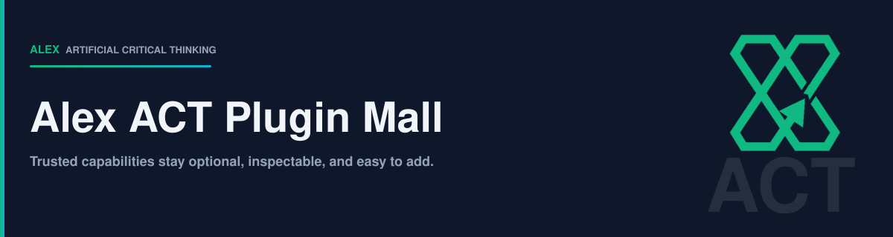

# Alex ACT Plugin Mall



Alex ACT Plugin Mall lets you add trusted capabilities to GitHub Copilot without copying a whole AI setup into every project. Start with **Alex ACT ONE**, a single install that covers critical thinking, engineering craft, prose and documentation, document conversion, and visual authoring.

The Mall publishes **359 curated plugins** for direct installation and maintains a **trust-scored discovery index** across **4,266 plugins** in **53 stores**.

- Installation is **opt-in** and user-invoked. It never changes your existing projects.
- Current release: **[v3.0.0](https://github.com/fabioc-aloha/Alex_Skill_Mall/releases/tag/v3.0.0)**.

---

## Quick install (GitHub Copilot CLI)

**Prerequisite:** the [GitHub Copilot CLI](https://docs.github.com/en/copilot/how-tos/set-up/install-copilot-cli). Confirm with `copilot --version`.

### 1. Register the marketplace (one-time)

```bash
copilot plugin marketplace add fabioc-aloha/Alex_Skill_Mall
```

This registers the `alex-mall` marketplace with the CLI. It reads `.github/plugin/marketplace.json` from this repo; no credentials required.

### 2. Browse and install a plugin

```bash
# Browse everything published by alex-mall
copilot plugin marketplace browse alex-mall

# Install a plugin (plugin@marketplace format)
copilot plugin install <plugin-name>@alex-mall

# Install the recommended runtime
copilot plugin install alex-act-one@alex-mall
```

Plugins install into `~/.copilot/installed-plugins/alex-mall/<plugin-name>/`.

### 3. Verify and manage

```bash
copilot plugin list                              # what is installed
copilot plugin update <plugin-name>@alex-mall    # pull the latest version
copilot plugin uninstall <plugin-name>@alex-mall # remove a plugin
copilot plugin marketplace list                  # registered marketplaces
copilot plugin marketplace remove alex-mall      # unregister the marketplace
```

---

## Build an Alex ACT setup

Alex ACT ONE is the recommended starting point. It installs once at user level, and Copilot CLI, VS Code, and Microsoft Scout all read the same copy on disk.

| What you want to do | Plugin | Published version | What it adds |
| --- | --- | --- | --- |
| Give Copilot one dependable setup across every project | [`alex-act-one`](https://github.com/fabioc-aloha/Alex_ACT_ONE/tree/v0.1.1) | `0.1.1` | Critical thinking and problem framing, engineering craft, prose and documentation, document conversion, visual authoring, and agent brain authoring |

### Recommended path

1. Install it with `copilot plugin install alex-act-one@alex-mall`.
2. Turn on the always-on instructions once in each app you use, with `/alex-act-one bootstrap-core`. Activation previews every file and waits for your approval before writing anything.
3. Skills are available immediately. Instructions apply per app, because each app keeps its own profile.

### The earlier constellation

Five plugins preceded Alex ACT ONE: `alex-act-core`, `alex-act-illustrator-plugin`, `alex-act-document-tools`, `alex-act-enterprise`, and `alex-act-ai-operations`. They stay published so existing installations keep working, and they are no longer maintained. Install Alex ACT ONE instead.

> **Private specialization:** `alex-act-msft` is private and intended only for Microsoft-internal work. It is not published in this public Mall.

---

## Use in VS Code

The Copilot CLI plugins integrate with **GitHub Copilot Chat** in VS Code once installed.

1. **Install the [GitHub Copilot](https://marketplace.visualstudio.com/items?itemName=GitHub.copilot) and [Copilot Chat](https://marketplace.visualstudio.com/items?itemName=GitHub.copilot-chat) extensions** in VS Code (1.117 or later).
2. **Install plugins via the Copilot CLI** using the steps above. In VS Code 1.131, keep Agent Skills enabled, disable the broken generic plugin-skill resolver, and disable automatic next-change reveal to avoid editor conflicts:

   ```jsonc
   "chat.useAgentSkills": true,
   "github.copilot.chat.skillTool.enabled": false,
   "chat.editing.revealNextChangeOnResolve": false
   ```

   Namespaced commands and agents remain available while the resolver workaround is active.
3. **Reload VS Code** or run *Developer: Reload Window* so Copilot Chat re-scans the installed plugins.
4. In Chat, invoke a plugin's commands with `/`, agents with `@`, or skills by describing the task the skill's frontmatter is scoped to.

---

## Per-repo auto-install

To make a project auto-install specific plugins for every collaborator, commit a `.github/copilot/settings.json` that names the marketplace **and** the plugins:

```jsonc
{
  "extraKnownMarketplaces": {
    "alex-mall": {
      "type": "github",
      "repository": "fabioc-aloha/Alex_Skill_Mall"
    }
  },
  "enabledPlugins": {
    "alex-act-one@alex-mall": true
  }
}
```

- **`extraKnownMarketplaces`** registers the marketplace so the CLI knows where to fetch from. Without it, plugin specs referencing `@alex-mall` will not resolve unless the collaborator has already registered `alex-mall` at the user level.
- **`enabledPlugins`** is the declarative auto-install list. Keys are plugin specs (`<name>@<marketplace>`); values are `true` (enabled) or `false` (disabled).
- A plugin enabled only through the repository file is **scoped to that repository** — it auto-installs and activates there, but stays inactive in unrelated projects.
- Both keys are read by the [GitHub Copilot CLI](https://docs.github.com/en/copilot/reference/copilot-cli-reference/cli-config-dir-reference) **and** by **Copilot cloud agent**, so the same file drives both local sessions and cloud-run sessions.

### Settings tiers (precedence order)

| File | Scope | Commit? |
| --- | --- | --- |
| `~/.copilot/settings.json` | User (your defaults for every repo) | No — personal machine |
| `.github/copilot/settings.json` | Repository (shared with collaborators) | **Yes** |
| `.github/copilot/settings.local.json` | Local overrides for this checkout | No — add to `.gitignore` |

The three files are merged in that order; later wins. For `enabledPlugins` and `extraKnownMarketplaces`, repository entries override user entries per key.

---

## Contribute a plugin

Open a pull request using the plugin-submission template. Automation checks the payload; a CODEOWNER decides whether it is accepted. [CONTRIBUTING.md](CONTRIBUTING.md) has the submission steps, evidence, and licensing requirements.

---

## Browse the catalog

- [Full catalog index](catalog/INDEX.md) — every plugin, sortable
- [By category](catalog/categories/) — 21 canonical categories plus uncategorized
- [By store](catalog/stores/) — per-source drilldown
- [Trust audit](scoring/TRUST-AUDIT.md) — score distribution and top plugins
- [Source registry](sources/SOURCES.md) — the 53 stores the discovery catalog aggregates

## Top 10 stores by trust

| Rank | Store | Trust | Plugins | Provenance |
| ---: | --- | ---: | ---: | --- |
| 1 | 🏆 [plugin-mall](catalog/stores/plugin-mall.md) | 82 | 359 | 🏆 first-party |
| 2 | [alirezarezvani-claude-skills](catalog/stores/alirezarezvani-claude-skills.md) | 35 | 43 | third-party |
| 3 | [antigravity-awesome-skills](catalog/stores/antigravity-awesome-skills.md) | 35 | 2032 | third-party |
| 4 | [awesome-copilot](catalog/stores/awesome-copilot.md) | 35 | 518 | third-party |
| 5 | [buildwithclaude](catalog/stores/buildwithclaude.md) | 35 | 114 | third-party |
| 6 | [claude-code-plugins-plus-skills](catalog/stores/claude-code-plugins-plus-skills.md) | 35 | 24 | third-party |
| 7 | [context-engineering-kit](catalog/stores/context-engineering-kit.md) | 35 | 13 | third-party |
| 8 | [daymade-claude-code-skills](catalog/stores/daymade-claude-code-skills.md) | 35 | 107 | third-party |
| 9 | [designer-skills](catalog/stores/designer-skills.md) | 35 | 9 | third-party |
| 10 | [dotnet-skills](catalog/stores/dotnet-skills.md) | 35 | 18 | third-party |

## How trust scoring works

Every plugin gets a 0–100 score from six published signals:

| Signal | Range | Source |
| --- | ---: | --- |
| Provenance | +50 | First-party `plugin-mall` entry |
| Store maintenance | 0–15 | Last upstream commit recency; first-party Mall is pinned to 15 as an editorial prior |
| Store adoption | 0–10 | GitHub stars + contributors; first-party Mall is pinned to 10 as an editorial prior |
| License clarity | 0–10 | OSI-approved=10, clear non-permissive=7 |
| Frontmatter completeness | 0–10 | description + version + lastReviewed presence |
| README presence | 0–5 | README excerpt ≥ 50 chars |

First-party plugins (🏆) rank highest because they earn the +50 provenance bonus. Third-party entries with `installable: true` retain an installation route; reference-only entries are discovery evidence, not install targets.

---
*Generated by `scripts/render-catalog.cjs` at 2026-09-13T22:28:19.014Z. Source of truth: `catalog/*.json`. Never hand-edit this README.*
