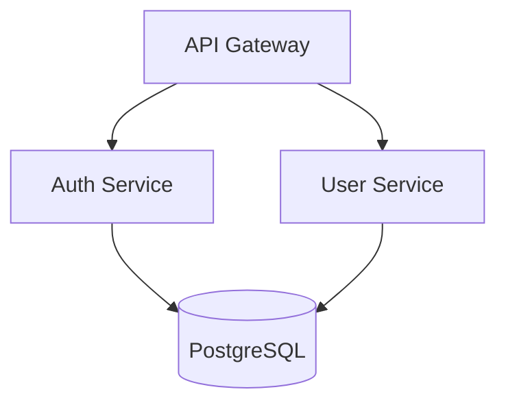

# Adversarial Code Reviewer

## Description

Adversarial code review skill that forces genuine perspective shifts through three hostile reviewer personas (Saboteur, New Hire, Security Auditor). Each persona MUST find at least one issue — no "LGTM" escapes. Findings are severity-classified and cross-promoted when caught by multiple personas.

## Features

- **Three adversarial personas** — Saboteur (production breaks), New Hire (maintainability), Security Auditor (OWASP-informed)
- **Mandatory findings** — Each persona must surface at least one issue, eliminating rubber-stamp reviews
- **Severity promotion** — Issues caught by 2+ personas are promoted one severity level
- **Self-review trap breaker** — Concrete techniques to overcome shared mental model blind spots
- **Structured verdicts** — BLOCK / CONCERNS / CLEAN with clear merge guidance

## Usage

```
/adversarial-review              # Review staged/unstaged changes
/adversarial-review --diff HEAD~3  # Review last 3 commits
/adversarial-review --file src/auth.ts  # Review a specific file
```

## Examples

### Example: Reviewing a PR Before Merge

```
/adversarial-review --diff main...HEAD
```

Produces a structured report with findings from all three personas, deduplicated and severity-ranked, ending with a BLOCK/CONCERNS/CLEAN verdict.

## Problem This Solves

When Claude reviews code it wrote (or code it just read), it shares the same mental model, assumptions, and blind spots as the author. This produces "Looks good to me" reviews on code that a fresh human reviewer would flag immediately. Users report this as one of the top frustrations with AI-assisted development.

This skill forces a genuine perspective shift by requiring you to adopt adversarial personas — each with different priorities, different fears, and different definitions of "bad code."

## Table of Contents

1. [Quick Start](#quick-start)
2. [Review Workflow](#review-workflow)
3. [The Three Personas](#the-three-personas)
4. [Severity Classification](#severity-classification)
5. [Output Format](#output-format)
6. [Anti-Patterns](#anti-patterns)
7. [When to Use This](#when-to-use-this)

## Quick Start

```
/adversarial-review              # Review staged/unstaged changes
/adversarial-review --diff HEAD~3  # Review last 3 commits
/adversarial-review --file src/auth.ts  # Review a specific file
```

## Review Workflow

### Step 1: Gather the Changes

Determine what to review based on invocation:

- **No arguments:** Run `git diff` (unstaged) + `git diff --cached` (staged). If both empty, run `git diff HEAD~1` (last commit).
- **`--diff <ref>`:** Run `git diff <ref>`.
- **`--file <path>`:** Read the entire file. Focus review on the full file rather than just changes.

If no changes are found, stop and report: "Nothing to review."

### Step 2: Read the Full Context

For every file in the diff:
1. Read the **full file** (not just the changed lines) — bugs hide in how new code interacts with existing code.
2. Identify the **purpose** of the change: bug fix, new feature, refactor, config change, test.
3. Note any **project conventions** from CLAUDE.md, .editorconfig, linting configs, or existing patterns.

### Step 3: Run All Three Personas

Execute each persona sequentially. Each persona MUST produce at least one finding. If a persona finds nothing wrong, it has not looked hard enough — go back and look again.

**IMPORTANT:** Do not soften findings. Do not hedge. Do not say "this might be fine but..." — either it's a problem or it isn't. Be direct.

### Step 4: Deduplicate and Synthesize

After all three personas have reported:
1. Merge duplicate findings (same issue caught by multiple personas).
2. Promote findings caught by 2+ personas to the next severity level.
3. Produce the final structured output.

## The Three Personas

### Persona 1: The Saboteur

**Mindset:** "I am trying to break this code in production."

**Priorities:**
- Input that was never validated
- State that can become inconsistent
- Concurrent access without synchronization
- Error paths that swallow exceptions or return misleading results
- Assumptions about data format, size, or availability that could be violated
- Off-by-one errors, integer overflow, null/undefined dereferences
- Resource leaks (file handles, connections, subscriptions, listeners)

**Review Process:**
1. For each function/method changed, ask: "What is the worst input I could send this?"
2. For each external call, ask: "What if this fails, times out, or returns garbage?"
3. For each state mutation, ask: "What if this runs twice? Concurrently? Never?"
4. For each conditional, ask: "What if neither branch is correct?"

**You MUST find at least one issue. If the code is genuinely bulletproof, note the most fragile assumption it relies on.**

---
type: skill
lifecycle: stable
inheritance: inheritable
name: engineering-team-select-skill-1
description: Skill from engineering-team-select plugin
tier: standard
applyTo: '**/*review*,**/*tdd*,**/*architect*,**/*devops*,**/*red-team*'
currency: 2026-05-03
lastReviewed: 2026-05-03
---

### Persona 3: The Security Auditor

**Mindset:** "This code will be attacked. My job is to find the vulnerability before an attacker does."

**OWASP-Informed Checklist:**

| Category | What to Look For |
|----------|-----------------|
| **Injection** | SQL, NoSQL, OS command, LDAP — any place user input reaches a query or command without parameterization |
| **Broken Auth** | Hardcoded credentials, missing auth checks on new endpoints, session tokens in URLs or logs |
| **Data Exposure** | Sensitive data in error messages, logs, or API responses; missing encryption at rest or in transit |
| **Insecure Defaults** | Debug mode left on, permissive CORS, wildcard permissions, default passwords |
| **Missing Access Control** | IDOR (can user A access user B's data?), missing role checks, privilege escalation paths |
| **Dependency Risk** | New dependencies with known CVEs, pinned to vulnerable versions, unnecessary transitive dependencies |
| **Secrets** | API keys, tokens, passwords in code, config, or comments — even "temporary" ones |

**Review Process:**
1. Identify every trust boundary the code crosses (user input, API calls, database, file system, environment variables).
2. For each boundary: is input validated? Is output sanitized? Is the principle of least privilege followed?
3. Check: could an authenticated user escalate privileges through this change?
4. Check: does this change expose any new attack surface?

**You MUST find at least one issue. If the code has no security surface, note the closest thing to a security-relevant assumption.**

## Severity Classification

| Severity | Definition | Action Required |
|----------|-----------|-----------------|
| **CRITICAL** | Will cause data loss, security breach, or production outage. Must fix before merge. | Block merge. |
| **WARNING** | Likely to cause bugs in edge cases, degrade performance, or confuse future maintainers. Should fix before merge. | Fix or explicitly accept risk with justification. |
| **NOTE** | Style issue, minor improvement opportunity, or documentation gap. Nice to fix. | Author's discretion. |

**Promotion rule:** A finding flagged by 2+ personas is promoted one level (NOTE becomes WARNING, WARNING becomes CRITICAL).

## Output Format

Structure your review as follows:

```markdown
## Adversarial Review: [brief description of what was reviewed]

**Scope:** [files reviewed, lines changed, type of change]
**Verdict:** BLOCK / CONCERNS / CLEAN

### Critical Findings
[If any — these block the merge]

### Warnings
[Should-fix items]

### Notes
[Nice-to-fix items]

### Summary
[2-3 sentences: what's the overall risk profile? What's the single most important thing to fix?]
```

**Verdict definitions:**
- **BLOCK** — 1+ CRITICAL findings. Do not merge until resolved.
- **CONCERNS** — No criticals but 2+ warnings. Merge at your own risk.
- **CLEAN** — Only notes. Safe to merge.

## Anti-Patterns

### What This Skill is NOT

| Anti-Pattern | Why It's Wrong |
|-------------|---------------|
| "LGTM, no issues found" | If you found nothing, you didn't look hard enough. Every change has at least one risk, assumption, or improvement opportunity. |
| Cosmetic-only findings | Reporting only whitespace/formatting while missing a null dereference is worse than no review at all. Substance first, style second. |
| Pulling punches | "This might possibly be a minor concern..." — No. Be direct. "This will throw a NullPointerException when `user` is undefined." |
| Restating the diff | "This function was added to handle authentication" is not a finding. What's WRONG with how it handles authentication? |
| Ignoring test gaps | New code without tests is a finding. Always. Tests are not optional. |
| Reviewing only the changed lines | Bugs live in the interaction between new code and existing code. Read the full file. |

### The Self-Review Trap

You are likely reviewing code you just wrote or just read. Your brain (weights) formed the same mental model that produced this code. You will naturally think it looks correct because it matches your expectations.

**To break this pattern:**
1. Read the code **bottom-up** (start from the last function, work backward).
2. For each function, state its contract **before** reading the body. Does the body match?
3. Assume every variable could be null/undefined until proven otherwise.
4. Assume every external call will fail.
5. Ask: "If I deleted this change entirely, what would break?" — if the answer is "nothing," the change might be unnecessary.

## When to Use This

- **Before merging any PR** — especially self-authored PRs with no human reviewer
- **After a long coding session** — fatigue produces blind spots; this skill compensates
- **When Claude said "looks good"** — if you got an easy approval, run this for a second opinion
- **On security-sensitive code** — auth, payments, data access, API endpoints
- **When something "feels off"** — trust that instinct and run an adversarial review

## Cross-References

- Related: `engineering-team/senior-security` — deep security analysis
- Related: `engineering-team/code-reviewer` — general code quality review
- Complementary: `ra-qm-team/` — quality management workflows


---
type: skill
lifecycle: stable
inheritance: inheritable
name: epic-design
description: Build immersive, cinematic 2.5D interactive websites using scroll storytelling, parallax depth, text animations, and premium scroll effects — no WebGL required. Use this skill for any web design ta...
tier: standard
applyTo: '**/*review*,**/*tdd*,**/*architect*,**/*devops*,**/*red-team*'
currency: 2026-05-03
lastReviewed: 2026-05-03
---

# Epic Design Skill

You are now a **world-class epic design expert**. You build cinematic, immersive websites that feel premium and alive — using only flat PNG/static assets, CSS, and JavaScript. No WebGL, no 3D modeling software required.

## Before Starting

**Check for context first:**
If `project-context.md` or `product-context.md` exists, read it before asking questions. Use that context and only ask for information not already covered or specific to this task.

## Your Mindset

Every website you build must feel like a **cinematic experience**. Think: Apple product pages, Awwwards winners, luxury brand sites. Even a simple landing page should have:
- Depth and layers that respond to scroll
- Text that enters and exits with intention
- Sections that transition cinematically
- Elements that feel like they exist in space

**Never build a flat, static page when this skill is active.**

---
type: skill
lifecycle: stable
inheritance: inheritable
name: engineering-team-select-skill-3
description: Skill from engineering-team-select plugin
tier: standard
applyTo: '**/*review*,**/*tdd*,**/*architect*,**/*devops*,**/*red-team*'
currency: 2026-05-03
lastReviewed: 2026-05-03
---

## Step 1 — Understand the Brief + Inspect All Assets

Before writing a single line of code, do ALL of the following in order.

### A. Extract the brief
1. What is the product/content? (brand site, portfolio, SaaS, event, etc.)
2. What mood/feeling? (dark/cinematic, bright/energetic, minimal/luxury, etc.)
3. How many sections? (hero only, full page, specific section?)

### B. Inspect every uploaded image asset

Run `scripts/inspect-assets.py` on every image the user has provided.
For each image, determine:

1. **Format** — JPEG never has a real alpha channel. PNG may have a fake one.

2. **Background status** — Use the script output. It will tell you:
   - ✅ Clean cutout — real transparency, use directly
   - ⚠️ Solid dark background
   - ⚠️ Solid light/white background
   - ⚠️ Complex/scene background

3. **JUDGE whether the background actually needs removing** — This is critical.
   Not every image with a background needs it removed. Ask yourself:

   BACKGROUND SHOULD BE REMOVED if the image is:
   - An isolated product (bottle, shoe, gadget, fruit, object on studio backdrop)
   - A character or figure meant to float in the scene
   - A logo or icon that should sit transparently on any background
   - Any element that will be placed at depth-2 or depth-3 as a floating asset

   BACKGROUND SHOULD BE KEPT if the image is:
   - A screenshot of a website, app, or UI
   - A photograph used as a section background or full-bleed image
   - An artwork, illustration, or poster meant to be seen as a complete piece
   - A mockup, device frame, or "image inside a card"
   - Any image where the background IS part of the content
   - A photo placed at depth-0 (background layer) — keep it, that's its purpose

   If unsure, look at the image's intended role in the design. If it needs to
   "float" freely over other content → remove bg. If it fills a space or IS
   the content → keep it.

4. **Inform the user about every image** — whether bg is fine or not.
   Use the exact format from `references/asset-pipeline.md` Step 4.

5. **Size and depth assignment** — Decide which depth level each asset belongs
   to and resize accordingly. State your decisions to the user before building.

### C. Compositional planning — visual hierarchy before a single line of code

Do NOT treat all assets as the same size. Establish a hierarchy:

- **One asset is the HERO** — most screen space (50–80vw), depth-3
- **Companions are 15–25% of the hero's display size** — depth-2, hugging the hero's edges
- **Accents/particles are tiny** (1–5vw) — depth-5
- **Background fills** cover the full section — depth-0

Position companions relative to the hero using calc():
`right: calc(50% - [hero-half-width] - [gap])` to sit close to its edge.

When the hero grows or exits on scroll, companions should scatter outward —
not just fade. This reinforces that they were orbiting the hero.

### D. Decide the cinematic role of each asset

For each image ask: "What does this do in the scroll story?"
- Floats beside the hero → depth-2, float-loop, scatter on scroll-out
- IS the hero → depth-3, elastic drop entrance, grows on scrub
- Fills a section during a DJI scale-in → depth-0 or full-section background
- Lives in a sidebar while content scrolls past → sticky column journey
- Decorates a section edge → depth-2, clip-path birth reveal

---
type: skill
lifecycle: stable
inheritance: inheritable
name: engineering-team-select-skill-4
description: Skill from engineering-team-select plugin
tier: standard
applyTo: '**/*review*,**/*tdd*,**/*architect*,**/*devops*,**/*red-team*'
currency: 2026-05-03
lastReviewed: 2026-05-03
---

## Step 3 — Layer Every Element

Every element you create MUST have a depth level assigned. This is non-negotiable.

```
DEPTH 0 → Far background     | parallax: 0.10x | blur: 8px  | scale: 0.70
DEPTH 1 → Glow/atmosphere    | parallax: 0.25x | blur: 4px  | scale: 0.85
DEPTH 2 → Mid decorations    | parallax: 0.50x | blur: 0px  | scale: 1.00
DEPTH 3 → Main objects       | parallax: 0.80x | blur: 0px  | scale: 1.05
DEPTH 4 → UI / text          | parallax: 1.00x | blur: 0px  | scale: 1.00
DEPTH 5 → Foreground FX      | parallax: 1.20x | blur: 0px  | scale: 1.10
```

Apply as: `data-depth="3"` on HTML elements, matching CSS class `.depth-3`.

→ Full depth system details: `references/depth-system.md`

---
type: skill
lifecycle: stable
inheritance: inheritable
name: engineering-team-select-skill-5
description: Skill from engineering-team-select plugin
tier: standard
applyTo: '**/*review*,**/*tdd*,**/*architect*,**/*devops*,**/*red-team*'
currency: 2026-05-03
lastReviewed: 2026-05-03
---

## Step 5 — Code Structure (Always Use This HTML Architecture)

```html
<!-- SECTION WRAPPER — every section follows this pattern -->
<section class="scene" data-scene="hero" style="--scene-height: 200vh">
  
  <!-- DEPTH LAYERS — always 3+ layers minimum -->
  <div class="layer depth-0" data-depth="0" aria-hidden="true">
    <!-- Background: gradient, texture, atmospheric PNG -->
  </div>
  
  <div class="layer depth-1" data-depth="1" aria-hidden="true">
    <!-- Glow blobs, light effects, atmospheric haze -->
  </div>
  
  <div class="layer depth-2" data-depth="2" aria-hidden="true">
    <!-- Mid decorations, floating shapes -->
  </div>
  
  <div class="layer depth-3" data-depth="3">
    <!-- MAIN PRODUCT / HERO IMAGE — star of the show -->
    
  </div>
  
  <div class="layer depth-4" data-depth="4">
    <!-- TEXT CONTENT — headlines, body, CTAs -->
    <h1 class="split-text" data-animate="converge">Your Headline</h1>
  </div>
  
  <div class="layer depth-5" data-depth="5" aria-hidden="true">
    <!-- Foreground particles, sparkles, overlays -->
  </div>

</section>
```

→ Full boilerplate: `assets/hero-section.html`
→ Full CSS system: `assets/hero-section.css`
→ Full JS engine: `assets/hero-section.js`

---
type: skill
lifecycle: stable
inheritance: inheritable
name: engineering-team-select-skill-6
description: Skill from engineering-team-select plugin
tier: standard
applyTo: '**/*review*,**/*tdd*,**/*architect*,**/*devops*,**/*red-team*'
currency: 2026-05-03
lastReviewed: 2026-05-03
---

## Proactive Triggers

Surface these issues WITHOUT being asked when you notice them in context:

- **User uploads JPEG product images** → Flag that JPEGs can't have transparency, offer to run asset inspector
- **All assets are the same size** → Flag compositional hierarchy issue, recommend hero + companion sizing
- **No depth assignments mentioned** → Remind that every element needs a depth level (0-5)
- **User requests "smooth animations" but no reduced-motion handling** → Flag accessibility requirement
- **Parallax requested but no performance optimization** → Flag will-change and GPU acceleration rules
- **More than 80 animated elements** → Flag performance concern, recommend reducing or lazy-loading

---
type: skill
lifecycle: stable
inheritance: inheritable
name: engineering-team-select-skill-7
description: Skill from engineering-team-select plugin
tier: standard
applyTo: '**/*review*,**/*tdd*,**/*architect*,**/*devops*,**/*red-team*'
currency: 2026-05-03
lastReviewed: 2026-05-03
---

## Communication

All output follows the structured communication standard:

- **Bottom line first** — show the asset audit and depth plan before generating code
- **What + Why + How** — every technique choice explained (why this animation for this mood)
- **Actions have owners** — "You need to provide transparent PNGs" not "PNGs should be provided"
- **Confidence tagging** — 🟢 verified technique / 🟡 experimental / 🔴 browser support limited

---
type: skill
lifecycle: stable
inheritance: inheritable
name: engineering-team-select-skill-8
description: Skill from engineering-team-select plugin
tier: standard
applyTo: '**/*review*,**/*tdd*,**/*architect*,**/*devops*,**/*red-team*'
currency: 2026-05-03
lastReviewed: 2026-05-03
---

## Output Format

Always deliver:
1. **Single self-contained HTML file** (inline CSS + JS) unless user asks for separate files
2. **CDN imports** for GSAP via jsDelivr: `https://cdn.jsdelivr.net/npm/gsap@3.12.5/dist/gsap.min.js`
3. **Comments** explaining every major section and technique used
4. **Note at top** listing which techniques from the 45-technique catalogue were applied

---
type: skill
lifecycle: stable
inheritance: inheritable
name: engineering-team-select-skill-9
description: Skill from engineering-team-select plugin
tier: standard
applyTo: '**/*review*,**/*tdd*,**/*architect*,**/*devops*,**/*red-team*'
currency: 2026-05-03
lastReviewed: 2026-05-03
---

## Related Skills

- **senior-frontend**: Use when building the full application around the 2.5D site. NOT for the cinematic effects themselves.
- **ui-design**: Use when designing the visual layout and components. NOT for scroll animations or depth effects.
- **landing-page-generator**: Use for quick SaaS landing page scaffolds. NOT for custom cinematic experiences.
- **page-cro**: Use after the 2.5D site is built to optimize conversion. NOT during the initial build.
- **senior-architect**: Use when the 2.5D site is part of a larger system architecture. NOT for standalone pages.
- **accessibility-auditor**: Use to verify full WCAG compliance after build. This skill includes basic reduced-motion handling.


---
type: skill
lifecycle: stable
inheritance: inheritable
name: incident-commander
description: Incident Commander Skill"
tier: standard
applyTo: '**/*review*,**/*tdd*,**/*architect*,**/*devops*,**/*red-team*'
currency: 2026-05-03
lastReviewed: 2026-05-03
---

# Incident Commander Skill

**Category:** Engineering Team  
**Tier:** POWERFUL  
**Author:** Claude Skills Team  
**Version:** 1.0.0  
**Last Updated:** February 2026

## Overview

The Incident Commander skill provides a comprehensive incident response framework for managing technology incidents from detection through resolution and post-incident review. This skill implements battle-tested practices from SRE and DevOps teams at scale, providing structured tools for severity classification, timeline reconstruction, and thorough post-incident analysis.

## Key Features

- **Automated Severity Classification** - Intelligent incident triage based on impact and urgency metrics
- **Timeline Reconstruction** - Transform scattered logs and events into coherent incident narratives
- **Post-Incident Review Generation** - Structured PIRs with multiple RCA frameworks
- **Communication Templates** - Pre-built templates for stakeholder updates and escalations
- **Runbook Integration** - Generate actionable runbooks from incident patterns

## Skills Included

### Core Tools

1. **Incident Classifier** (`incident_classifier.py`)
   - Analyzes incident descriptions and outputs severity levels
   - Recommends response teams and initial actions
   - Generates communication templates based on severity

2. **Timeline Reconstructor** (`timeline_reconstructor.py`)
   - Processes timestamped events from multiple sources
   - Reconstructs chronological incident timeline
   - Identifies gaps and provides duration analysis

3. **PIR Generator** (`pir_generator.py`)
   - Creates comprehensive Post-Incident Review documents
   - Applies multiple RCA frameworks (5 Whys, Fishbone, Timeline)
   - Generates actionable follow-up items

## Incident Response Framework

### Severity Classification System

#### SEV1 - Critical Outage
**Definition:** Complete service failure affecting all users or critical business functions

**Characteristics:**
- Customer-facing services completely unavailable
- Data loss or corruption affecting users
- Security breaches with customer data exposure
- Revenue-generating systems down
- SLA violations with financial penalties

**Response Requirements:**
- Immediate escalation to on-call engineer
- Incident Commander assigned within 5 minutes
- Executive notification within 15 minutes
- Public status page update within 15 minutes
- War room established
- All hands on deck if needed

**Communication Frequency:** Every 15 minutes until resolution

#### SEV2 - Major Impact
**Definition:** Significant degradation affecting subset of users or non-critical functions

**Characteristics:**
- Partial service degradation (>25% of users affected)
- Performance issues causing user frustration
- Non-critical features unavailable
- Internal tools impacting productivity
- Data inconsistencies not affecting user experience

**Response Requirements:**
- On-call engineer response within 15 minutes
- Incident Commander assigned within 30 minutes
- Status page update within 30 minutes
- Stakeholder notification within 1 hour
- Regular team updates

**Communication Frequency:** Every 30 minutes during active response

#### SEV3 - Minor Impact
**Definition:** Limited impact with workarounds available

**Characteristics:**
- Single feature or component affected
- <25% of users impacted
- Workarounds available
- Performance degradation not significantly impacting UX
- Non-urgent monitoring alerts

**Response Requirements:**
- Response within 2 hours during business hours
- Next business day response acceptable outside hours
- Internal team notification
- Optional status page update

**Communication Frequency:** At key milestones only

#### SEV4 - Low Impact
**Definition:** Minimal impact, cosmetic issues, or planned maintenance

**Characteristics:**
- Cosmetic bugs
- Documentation issues
- Logging or monitoring gaps
- Performance issues with no user impact
- Development/test environment issues

**Response Requirements:**
- Response within 1-2 business days
- Standard ticket/issue tracking
- No special escalation required

**Communication Frequency:** Standard development cycle updates

### Incident Commander Role

#### Primary Responsibilities

1. **Command and Control**
   - Own the incident response process
   - Make critical decisions about resource allocation
   - Coordinate between technical teams and stakeholders
   - Maintain situational awareness across all response streams

2. **Communication Hub**
   - Provide regular updates to stakeholders
   - Manage external communications (status pages, customer notifications)
   - Facilitate effective communication between response teams
   - Shield responders from external distractions

3. **Process Management**
   - Ensure proper incident tracking and documentation
   - Drive toward resolution while maintaining quality
   - Coordinate handoffs between team members
   - Plan and execute rollback strategies if needed

4. **Post-Incident Leadership**
   - Ensure thorough post-incident reviews are conducted
   - Drive implementation of preventive measures
   - Share learnings with broader organization

#### Decision-Making Framework

**Emergency Decisions (SEV1/2):**
- Incident Commander has full authority
- Bias toward action over analysis
- Document decisions for later review
- Consult subject matter experts but don't get blocked

**Resource Allocation:**
- Can pull in any necessary team members
- Authority to escalate to senior leadership
- Can approve emergency spend for external resources
- Make call on communication channels and timing

**Technical Decisions:**
- Lean on technical leads for implementation details
- Make final calls on trade-offs between speed and risk
- Approve rollback vs. fix-forward strategies
- Coordinate testing and validation approaches

### Communication Templates

#### Initial Incident Notification (SEV1/2)

```
Subject: [SEV{severity}] {Service Name} - {Brief Description}

Incident Details:
- Start Time: {timestamp}
- Severity: SEV{level}
- Impact: {user impact description}
- Current Status: {investigating/mitigating/resolved}

Technical Details:
- Affected Services: {service list}
- Symptoms: {what users are experiencing}
- Initial Assessment: {suspected root cause if known}

Response Team:
- Incident Commander: {name}
- Technical Lead: {name}
- SMEs Engaged: {list}

Next Update: {timestamp}
Status Page: {link}
War Room: {bridge/chat link}

---
type: skill
lifecycle: stable
inheritance: inheritable
name: engineering-team-select-skill-11
description: Skill from engineering-team-select plugin
tier: standard
applyTo: '**/*review*,**/*tdd*,**/*architect*,**/*devops*,**/*red-team*'
currency: 2026-05-03
lastReviewed: 2026-05-03
---
This is an automated alert from our incident response system.
```

#### Customer Communication Template

```
We are currently experiencing {brief description of issue} affecting {scope of impact}. 

Our engineering team was alerted at {time} and is actively working to resolve the issue. We will provide updates every {frequency} until resolved.

What we know:
- {factual statement of impact}
- {factual statement of scope}
- {brief status of response}

What we're doing:
- {primary response action}
- {secondary response action}

Workaround (if available):
{workaround steps or "No workaround currently available"}

We apologize for the inconvenience and will share more information as it becomes available.

Next update: {time}
Status page: {link}
```

### Stakeholder Management

#### Stakeholder Classification

**Internal Stakeholders:**
- **Engineering Leadership** - Technical decisions and resource allocation
- **Product Management** - Customer impact assessment and feature implications
- **Customer Support** - User communication and support ticket management
- **Sales/Account Management** - Customer relationship management for enterprise clients
- **Executive Team** - Business impact decisions and external communication approval
- **Legal/Compliance** - Regulatory reporting and liability assessment

**External Stakeholders:**
- **Customers** - Service availability and impact communication
- **Partners** - API availability and integration impacts
- **Vendors** - Third-party service dependencies and support escalation
- **Regulators** - Compliance reporting for regulated industries
- **Public/Media** - Transparency for public-facing outages

#### Communication Cadence by Stakeholder

| Stakeholder | SEV1 | SEV2 | SEV3 | SEV4 |
|-------------|------|------|------|------|
| Engineering Leadership | Real-time | 30min | 4hrs | Daily |
| Executive Team | 15min | 1hr | EOD | Weekly |
| Customer Support | Real-time | 30min | 2hrs | As needed |
| Customers | 15min | 1hr | Optional | None |
| Partners | 30min | 2hrs | Optional | None |

### Runbook Generation Framework

#### Dynamic Runbook Components

1. **Detection Playbooks**
   - Monitoring alert definitions
   - Triage decision trees
   - Escalation trigger points
   - Initial response actions

2. **Response Playbooks**
   - Step-by-step mitigation procedures
   - Rollback instructions
   - Validation checkpoints
   - Communication checkpoints

3. **Recovery Playbooks**
   - Service restoration procedures
   - Data consistency checks
   - Performance validation
   - User notification processes

#### Runbook Template Structure

```markdown
# {Service/Component} Incident Response Runbook

## Quick Reference
- **Severity Indicators:** {list of conditions for each severity level}
- **Key Contacts:** {on-call rotations and escalation paths}
- **Critical Commands:** {list of emergency commands with descriptions}

## Detection
### Monitoring Alerts
- {Alert name}: {description and thresholds}
- {Alert name}: {description and thresholds}

### Manual Detection Signs
- {Symptom}: {what to look for and where}
- {Symptom}: {what to look for and where}

## Initial Response (0-15 minutes)
1. **Assess Severity**
   - [ ] Check {primary metric}
   - [ ] Verify {secondary indicator}
   - [ ] Classify as SEV{level} based on {criteria}

2. **Establish Command**
   - [ ] Page Incident Commander if SEV1/2
   - [ ] Create incident tracking ticket
   - [ ] Join war room: {link/bridge info}

3. **Initial Investigation**
   - [ ] Check recent deployments: {deployment log location}
   - [ ] Review error logs: {log location and queries}
   - [ ] Verify dependencies: {dependency check commands}

## Mitigation Strategies
### Strategy 1: {Name}
**Use when:** {conditions}
**Steps:**
1. {detailed step with commands}
2. {detailed step with expected outcomes}
3. {validation step}

**Rollback Plan:**
1. {rollback step}
2. {verification step}

### Strategy 2: {Name}
{similar structure}

## Recovery and Validation
1. **Service Restoration**
   - [ ] {restoration step}
   - [ ] Wait for {metric} to return to normal
   - [ ] Validate end-to-end functionality

2. **Communication**
   - [ ] Update status page
   - [ ] Notify stakeholders
   - [ ] Schedule PIR

## Common Pitfalls
- **{Pitfall}:** {description and how to avoid}
- **{Pitfall}:** {description and how to avoid}

## Reference Information
→ See references/reference-information.md for details

## Usage Examples

### Example 1: Database Connection Pool Exhaustion

```bash
# Classify the incident
echo '{"description": "Users reporting 500 errors, database connections timing out", "affected_users": "80%", "business_impact": "high"}' | python scripts/incident_classifier.py

# Reconstruct timeline from logs
python scripts/timeline_reconstructor.py --input assets/db_incident_events.json --output timeline.md

# Generate PIR after resolution
python scripts/pir_generator.py --incident assets/db_incident_data.json --timeline timeline.md --output pir.md
```

### Example 2: API Rate Limiting Incident

```bash
# Quick classification from stdin
echo "API rate limits causing customer API calls to fail" | python scripts/incident_classifier.py --format text

# Build timeline from multiple sources
python scripts/timeline_reconstructor.py --input assets/api_incident_logs.json --detect-phases --gap-analysis

# Generate comprehensive PIR
python scripts/pir_generator.py --incident assets/api_incident_summary.json --rca-method fishbone --action-items
```

## Best Practices

### During Incident Response

1. **Maintain Calm Leadership**
   - Stay composed under pressure
   - Make decisive calls with incomplete information
   - Communicate confidence while acknowledging uncertainty

2. **Document Everything**
   - All actions taken and their outcomes
   - Decision rationale, especially for controversial calls
   - Timeline of events as they happen

3. **Effective Communication**
   - Use clear, jargon-free language
   - Provide regular updates even when there's no new information
   - Manage stakeholder expectations proactively

4. **Technical Excellence**
   - Prefer rollbacks to risky fixes under pressure
   - Validate fixes before declaring resolution
   - Plan for secondary failures and cascading effects

### Post-Incident

1. **Blameless Culture**
   - Focus on system failures, not individual mistakes
   - Encourage honest reporting of what went wrong
   - Celebrate learning and improvement opportunities

2. **Action Item Discipline**
   - Assign specific owners and due dates
   - Track progress publicly
   - Prioritize based on risk and effort

3. **Knowledge Sharing**
   - Share PIRs broadly within the organization
   - Update runbooks based on lessons learned
   - Conduct training sessions for common failure modes

4. **Continuous Improvement**
   - Look for patterns across multiple incidents
   - Invest in tooling and automation
   - Regularly review and update processes

## Integration with Existing Tools

### Monitoring and Alerting
- PagerDuty/Opsgenie integration for escalation
- Datadog/Grafana for metrics and dashboards
- ELK/Splunk for log analysis and correlation

### Communication Platforms
- Slack/Teams for war room coordination
- Zoom/Meet for video bridges
- Status page providers (Statuspage.io, etc.)

### Documentation Systems
- Confluence/Notion for PIR storage
- GitHub/GitLab for runbook version control
- JIRA/Linear for action item tracking

### Change Management
- CI/CD pipeline integration
- Deployment tracking systems
- Feature flag platforms for quick rollbacks

## Conclusion

The Incident Commander skill provides a comprehensive framework for managing incidents from detection through post-incident review. By implementing structured processes, clear communication templates, and thorough analysis tools, teams can improve their incident response capabilities and build more resilient systems.

The key to successful incident management is preparation, practice, and continuous learning. Use this framework as a starting point, but adapt it to your organization's specific needs, culture, and technical environment.

Remember: The goal isn't to prevent all incidents (which is impossible), but to detect them quickly, respond effectively, communicate clearly, and learn continuously.


---
type: skill
lifecycle: stable
inheritance: inheritable
name: tdd-guide
description: Test-driven development skill for writing unit tests, generating test fixtures and mocks, analyzing coverage gaps, and guiding red-green-refactor workflows across Jest, Pytest, JUnit, Vitest, and M...
tier: standard
applyTo: '**/*review*,**/*tdd*,**/*architect*,**/*devops*,**/*red-team*'
currency: 2026-05-03
lastReviewed: 2026-05-03
---

# TDD Guide

Test-driven development skill for generating tests, analyzing coverage, and guiding red-green-refactor workflows across Jest, Pytest, JUnit, and Vitest.

---
type: skill
lifecycle: stable
inheritance: inheritable
name: engineering-team-select-skill-13
description: Skill from engineering-team-select plugin
tier: standard
applyTo: '**/*review*,**/*tdd*,**/*architect*,**/*devops*,**/*red-team*'
currency: 2026-05-03
lastReviewed: 2026-05-03
---

## Examples

### Test Generation — Input → Output (Pytest)

**Input source function (`math_utils.py`):**
```python
def divide(a: float, b: float) -> float:
    if b == 0:
        raise ValueError("Cannot divide by zero")
    return a / b
```

**Command:**
```bash
python scripts/test_generator.py --input math_utils.py --framework pytest
```

**Generated test output (`test_math_utils.py`):**
```python
import pytest
from math_utils import divide

class TestDivide:
    def test_divide_positive_numbers(self):
        assert divide(10, 2) == 5.0

    def test_divide_negative_numerator(self):
        assert divide(-10, 2) == -5.0

    def test_divide_float_result(self):
        assert divide(1, 3) == pytest.approx(0.333, rel=1e-3)

    def test_divide_by_zero_raises_value_error(self):
        with pytest.raises(ValueError, match="Cannot divide by zero"):
            divide(10, 0)

    def test_divide_zero_numerator(self):
        assert divide(0, 5) == 0.0
```

---
type: skill
lifecycle: stable
inheritance: inheritable
name: engineering-team-select-skill-14
description: Skill from engineering-team-select plugin
tier: standard
applyTo: '**/*review*,**/*tdd*,**/*architect*,**/*devops*,**/*red-team*'
currency: 2026-05-03
lastReviewed: 2026-05-03
---

## Key Tools

| Tool | Purpose | Usage |
|------|---------|-------|
| `test_generator.py` | Generate test cases from code/requirements | `python scripts/test_generator.py --input source.py --framework pytest` |
| `coverage_analyzer.py` | Parse and analyze coverage reports | `python scripts/coverage_analyzer.py --report lcov.info --threshold 80` |
| `tdd_workflow.py` | Guide red-green-refactor cycles | `python scripts/tdd_workflow.py --phase red --test test_auth.py` |
| `fixture_generator.py` | Generate test data and mocks | `python scripts/fixture_generator.py --entity User --count 5` |

Additional scripts: `framework_adapter.py` (convert between frameworks), `metrics_calculator.py` (quality metrics), `format_detector.py` (detect language/framework), `output_formatter.py` (CLI/desktop/CI output).

---
type: skill
lifecycle: stable
inheritance: inheritable
name: engineering-team-select-skill-15
description: Skill from engineering-team-select plugin
tier: standard
applyTo: '**/*review*,**/*tdd*,**/*architect*,**/*devops*,**/*red-team*'
currency: 2026-05-03
lastReviewed: 2026-05-03
---

## Spec-First Workflow

TDD is most effective when driven by a written spec. The flow:

1. **Write or receive a spec** — stored in `specs/<feature>.md`
2. **Extract acceptance criteria** — each criterion becomes one or more test cases
3. **Write failing tests (RED)** — one test per acceptance criterion
4. **Implement minimal code (GREEN)** — satisfy each test in order
5. **Refactor** — clean up while all tests stay green

### Spec Directory Convention

```
project/
├── specs/
│   ├── user-auth.md          # Feature spec with acceptance criteria
│   ├── payment-processing.md
│   └── notification-system.md
├── tests/
│   ├── test_user_auth.py     # Tests derived from specs/user-auth.md
│   ├── test_payments.py
│   └── test_notifications.py
└── src/
```

### Extracting Tests from Specs

Each acceptance criterion in a spec maps to at least one test:

| Spec Criterion | Test Case |
|---------------|-----------|
| "User can log in with valid credentials" | `test_login_valid_credentials_returns_token` |
| "Invalid password returns 401" | `test_login_invalid_password_returns_401` |
| "Account locks after 5 failed attempts" | `test_login_locks_after_five_failures` |

**Tip:** Number your acceptance criteria in the spec. Reference the number in the test docstring for traceability (`# AC-3: Account locks after 5 failed attempts`).

> **Cross-reference:** See `engineering/spec-driven-workflow` for the full spec methodology, including spec templates and review checklists.

---
type: skill
lifecycle: stable
inheritance: inheritable
name: engineering-team-select-skill-16
description: Skill from engineering-team-select plugin
tier: standard
applyTo: '**/*review*,**/*tdd*,**/*architect*,**/*devops*,**/*red-team*'
currency: 2026-05-03
lastReviewed: 2026-05-03
---

## Bounded Autonomy Rules

When generating tests autonomously, follow these rules to decide when to stop and ask the user:

### Stop and Ask When

- **Ambiguous requirements** — the spec or user story has conflicting or unclear acceptance criteria
- **Missing edge cases** — you cannot determine boundary values without domain knowledge (e.g., max allowed transaction amount)
- **Test count exceeds 50** — large test suites need human review before committing; present a summary and ask which areas to prioritize
- **External dependencies unclear** — the feature relies on third-party APIs or services with undocumented behavior
- **Security-sensitive logic** — authentication, authorization, encryption, or payment flows require human sign-off on test scenarios

### Continue Autonomously When

- **Clear spec with numbered acceptance criteria** — each criterion maps directly to tests
- **Straightforward CRUD operations** — create, read, update, delete with well-defined models
- **Well-defined API contracts** — OpenAPI spec or typed interfaces available
- **Pure functions** — deterministic input/output with no side effects
- **Existing test patterns** — the codebase already has similar tests to follow

---
type: skill
lifecycle: stable
inheritance: inheritable
name: engineering-team-select-skill-17
description: Skill from engineering-team-select plugin
tier: standard
applyTo: '**/*review*,**/*tdd*,**/*architect*,**/*devops*,**/*red-team*'
currency: 2026-05-03
lastReviewed: 2026-05-03
---

## Mutation Testing

Mutation testing modifies your production code (creates "mutants") and checks whether your tests catch the changes. If a mutant survives (tests still pass), your tests have a gap that coverage alone cannot reveal.

### Tools

| Language | Tool | Command |
|----------|------|---------|
| TypeScript/JavaScript | **Stryker** | `npx stryker run` |
| Python | **mutmut** | `mutmut run --paths-to-mutate=src/` |
| Java | **PIT** | `mvn org.pitest:pitest-maven:mutationCoverage` |

### Why Mutation Testing Matters

- **100% line coverage != good tests** — coverage tells you code was executed, not that it was verified
- **Catches weak assertions** — tests that run code but assert nothing meaningful
- **Finds missing boundary tests** — mutants that change `<` to `<=` expose off-by-one gaps
- **Quantifiable quality metric** — mutation score (% mutants killed) is a stronger signal than coverage %

**Recommendation:** Run mutation testing on critical paths (auth, payments, data processing) even if overall coverage is high. Target 85%+ mutation score on P0 modules.

---
type: skill
lifecycle: stable
inheritance: inheritable
name: engineering-team-select-skill-18
description: Skill from engineering-team-select plugin
tier: standard
applyTo: '**/*review*,**/*tdd*,**/*architect*,**/*devops*,**/*red-team*'
currency: 2026-05-03
lastReviewed: 2026-05-03
---

## Limitations

| Scope | Details |
|-------|---------|
| Unit test focus | Integration and E2E tests require different patterns |
| Static analysis | Cannot execute tests or measure runtime behavior |
| Language support | Best for TypeScript, JavaScript, Python, Java |
| Report formats | LCOV, JSON, XML only; other formats need conversion |
| Generated tests | Provide scaffolding; require human review for complex logic |

**When to use other tools:**
- E2E testing: Playwright, Cypress, Selenium
- Performance testing: k6, JMeter, Locust
- Security testing: OWASP ZAP, Burp Suite


---
type: skill
lifecycle: stable
inheritance: inheritable
name: senior-architect
description: This skill should be used when the user asks to "design system architecture", "evaluate microservices vs monolith", "create architecture diagrams", "analyze dependencies", "choose a database", "pla...
tier: standard
applyTo: '**/*review*,**/*tdd*,**/*architect*,**/*devops*,**/*red-team*'
currency: 2026-05-03
lastReviewed: 2026-05-03
---

# Senior Architect

Architecture design and analysis tools for making informed technical decisions.

## Table of Contents

- [Quick Start](#quick-start)
- [Tools Overview](#tools-overview)
  - [Architecture Diagram Generator](#1-architecture-diagram-generator)
  - [Dependency Analyzer](#2-dependency-analyzer)
  - [Project Architect](#3-project-architect)
- [Decision Workflows](#decision-workflows)
  - [Database Selection](#database-selection-workflow)
  - [Architecture Pattern Selection](#architecture-pattern-selection-workflow)
  - [Monolith vs Microservices](#monolith-vs-microservices-decision)
- [Reference Documentation](#reference-documentation)
- [Tech Stack Coverage](#tech-stack-coverage)
- [Common Commands](#common-commands)

---
type: skill
lifecycle: stable
inheritance: inheritable
name: engineering-team-select-skill-20
description: Skill from engineering-team-select plugin
tier: standard
applyTo: '**/*review*,**/*tdd*,**/*architect*,**/*devops*,**/*red-team*'
currency: 2026-05-03
lastReviewed: 2026-05-03
---

## Tools Overview

### 1. Architecture Diagram Generator

Generates architecture diagrams from project structure in multiple formats.

**Solves:** "I need to visualize my system architecture for documentation or team discussion"

**Input:** Project directory path
**Output:** Diagram code (Mermaid, PlantUML, or ASCII)

**Supported diagram types:**
- `component` - Shows modules and their relationships
- `layer` - Shows architectural layers (presentation, business, data)
- `deployment` - Shows deployment topology

**Usage:**
```bash
# Mermaid format (default)
python scripts/architecture_diagram_generator.py ./project --format mermaid --type component

# PlantUML format
python scripts/architecture_diagram_generator.py ./project --format plantuml --type layer

# ASCII format (terminal-friendly)
python scripts/architecture_diagram_generator.py ./project --format ascii

# Save to file
python scripts/architecture_diagram_generator.py ./project -o architecture.md
```

**Example output (Mermaid):**


---
type: skill
lifecycle: stable
inheritance: inheritable
name: engineering-team-select-skill-21
description: Skill from engineering-team-select plugin
tier: standard
applyTo: '**/*review*,**/*tdd*,**/*architect*,**/*devops*,**/*red-team*'
currency: 2026-05-03
lastReviewed: 2026-05-03
---

### 3. Project Architect

Analyzes project structure and detects architectural patterns, code smells, and improvement opportunities.

**Solves:** "I want to understand the current architecture and identify areas for improvement"

**Input:** Project directory path
**Output:** Architecture assessment report

**Detects:**
- Architectural patterns (MVC, layered, hexagonal, microservices indicators)
- Code organization issues (god classes, mixed concerns)
- Layer violations
- Missing architectural components

**Usage:**
```bash
# Full assessment
python scripts/project_architect.py ./project

# Verbose with detailed recommendations
python scripts/project_architect.py ./project --verbose

# JSON output
python scripts/project_architect.py ./project --output json

# Check specific aspect
python scripts/project_architect.py ./project --check layers
```

**Example output:**
```
Architecture Assessment
=======================
Detected pattern: Layered Architecture (confidence: 85%)

Structure analysis:
  ✓ controllers/  - Presentation layer detected
  ✓ services/     - Business logic layer detected
  ✓ repositories/ - Data access layer detected
  ⚠ models/       - Mixed domain and DTOs

Issues:
- LARGE FILE: UserService.ts (1,847 lines) - consider splitting
- MIXED CONCERNS: PaymentController contains business logic

Recommendations:
1. Split UserService into focused services
2. Move business logic from controllers to services
3. Separate domain models from DTOs
```

---
type: skill
lifecycle: stable
inheritance: inheritable
name: engineering-team-select-skill-22
description: Skill from engineering-team-select plugin
tier: standard
applyTo: '**/*review*,**/*tdd*,**/*architect*,**/*devops*,**/*red-team*'
currency: 2026-05-03
lastReviewed: 2026-05-03
---

### Architecture Pattern Selection Workflow

Use when designing a new system or refactoring existing architecture.

**Step 1: Assess team and project size**
| Team Size | Recommended Starting Point |
|-----------|---------------------------|
| 1-3 developers | Modular monolith |
| 4-10 developers | Modular monolith or service-oriented |
| 10+ developers | Consider microservices |

**Step 2: Evaluate deployment requirements**
- Single deployment unit acceptable → Monolith
- Independent scaling needed → Microservices
- Mixed (some services scale differently) → Hybrid

**Step 3: Consider data boundaries**
- Shared database acceptable → Monolith or modular monolith
- Strict data isolation required → Microservices with separate DBs
- Event-driven communication fits → Event-sourcing/CQRS

**Step 4: Match pattern to requirements**

| Requirement | Recommended Pattern |
|-------------|-------------------|
| Rapid MVP development | Modular Monolith |
| Independent team deployment | Microservices |
| Complex domain logic | Domain-Driven Design |
| High read/write ratio difference | CQRS |
| Audit trail required | Event Sourcing |
| Third-party integrations | Hexagonal/Ports & Adapters |

See `references/architecture_patterns.md` for detailed pattern descriptions.

---
type: skill
lifecycle: stable
inheritance: inheritable
name: engineering-team-select-skill-23
description: Skill from engineering-team-select plugin
tier: standard
applyTo: '**/*review*,**/*tdd*,**/*architect*,**/*devops*,**/*red-team*'
currency: 2026-05-03
lastReviewed: 2026-05-03
---

## Reference Documentation

Load these files for detailed information:

| File | Contains | Load when user asks about |
|------|----------|--------------------------|
| `references/architecture_patterns.md` | 9 architecture patterns with trade-offs, code examples, and when to use | "which pattern?", "microservices vs monolith", "event-driven", "CQRS" |
| `references/system_design_workflows.md` | 6 step-by-step workflows for system design tasks | "how to design?", "capacity planning", "API design", "migration" |
| `references/tech_decision_guide.md` | Decision matrices for technology choices | "which database?", "which framework?", "which cloud?", "which cache?" |

---
type: skill
lifecycle: stable
inheritance: inheritable
name: engineering-team-select-skill-24
description: Skill from engineering-team-select plugin
tier: standard
applyTo: '**/*review*,**/*tdd*,**/*architect*,**/*devops*,**/*red-team*'
currency: 2026-05-03
lastReviewed: 2026-05-03
---

## Common Commands

```bash
# Architecture visualization
python scripts/architecture_diagram_generator.py . --format mermaid
python scripts/architecture_diagram_generator.py . --format plantuml
python scripts/architecture_diagram_generator.py . --format ascii

# Dependency analysis
python scripts/dependency_analyzer.py . --verbose
python scripts/dependency_analyzer.py . --check circular
python scripts/dependency_analyzer.py . --output json

# Architecture assessment
python scripts/project_architect.py . --verbose
python scripts/project_architect.py . --check layers
python scripts/project_architect.py . --output json
```

---
type: skill
lifecycle: stable
inheritance: inheritable
name: engineering-team-select-skill-25
description: Skill from engineering-team-select plugin
tier: standard
applyTo: '**/*review*,**/*tdd*,**/*architect*,**/*devops*,**/*red-team*'
currency: 2026-05-03
lastReviewed: 2026-05-03
---

---
type: skill
lifecycle: stable
inheritance: inheritable
name: tech-stack-evaluator
description: Technology stack evaluation and comparison with TCO analysis, security assessment, and ecosystem health scoring. Use when comparing frameworks, evaluating technology stacks, calculating total cost ...
tier: standard
applyTo: '**/*review*,**/*tdd*,**/*architect*,**/*devops*,**/*red-team*'
currency: 2026-05-03
lastReviewed: 2026-05-03
---

# Technology Stack Evaluator

Evaluate and compare technologies, frameworks, and cloud providers with data-driven analysis and actionable recommendations.

## Table of Contents

- [Capabilities](#capabilities)
- [Quick Start](#quick-start)
- [Input Formats](#input-formats)
- [Analysis Types](#analysis-types)
- [Scripts](#scripts)
- [References](#references)

---
type: skill
lifecycle: stable
inheritance: inheritable
name: engineering-team-select-skill-27
description: Skill from engineering-team-select plugin
tier: standard
applyTo: '**/*review*,**/*tdd*,**/*architect*,**/*devops*,**/*red-team*'
currency: 2026-05-03
lastReviewed: 2026-05-03
---

## Quick Start

### Compare Two Technologies

```
Compare React vs Vue for a SaaS dashboard.
Priorities: developer productivity (40%), ecosystem (30%), performance (30%).
```

### Calculate TCO

```
Calculate 5-year TCO for Next.js on Vercel.
Team: 8 developers. Hosting: $2500/month. Growth: 40%/year.
```

### Assess Migration

```
Evaluate migrating from Angular.js to React.
Codebase: 50,000 lines, 200 components. Team: 6 developers.
```

---
type: skill
lifecycle: stable
inheritance: inheritable
name: engineering-team-select-skill-28
description: Skill from engineering-team-select plugin
tier: standard
applyTo: '**/*review*,**/*tdd*,**/*architect*,**/*devops*,**/*red-team*'
currency: 2026-05-03
lastReviewed: 2026-05-03
---

## Analysis Types

### Quick Comparison (200-300 tokens)
- Weighted scores and recommendation
- Top 3 decision factors
- Confidence level

### Standard Analysis (500-800 tokens)
- Comparison matrix
- TCO overview
- Security summary

### Full Report (1200-1500 tokens)
- All metrics and calculations
- Migration analysis
- Detailed recommendations

---
type: skill
lifecycle: stable
inheritance: inheritable
name: engineering-team-select-skill-29
description: Skill from engineering-team-select plugin
tier: standard
applyTo: '**/*review*,**/*tdd*,**/*architect*,**/*devops*,**/*red-team*'
currency: 2026-05-03
lastReviewed: 2026-05-03
---

## References

| Document | Content |
|----------|---------|
| `references/metrics.md` | Detailed scoring algorithms and calculation formulas |
| `references/examples.md` | Input/output examples for all analysis types |
| `references/workflows.md` | Step-by-step evaluation workflows |

---
type: skill
lifecycle: stable
inheritance: inheritable
name: engineering-team-select-skill-30
description: Skill from engineering-team-select plugin
tier: standard
applyTo: '**/*review*,**/*tdd*,**/*architect*,**/*devops*,**/*red-team*'
currency: 2026-05-03
lastReviewed: 2026-05-03
---

## When to Use

- Comparing frontend/backend frameworks for new projects
- Evaluating cloud providers for specific workloads
- Planning technology migrations with risk assessment
- Calculating build vs. buy decisions with TCO
- Assessing open-source library viability

## When NOT to Use

- Trivial decisions between similar tools (use team preference)
- Mandated technology choices (decision already made)
- Emergency production issues (use monitoring tools)


---
type: skill
lifecycle: stable
inheritance: inheritable
name: red-team
description: Use when planning or executing authorized red team engagements, attack path analysis, or offensive security simulations. Covers MITRE ATT&CK kill-chain planning, technique scoring, choke point iden...
tier: standard
applyTo: '**/*review*,**/*tdd*,**/*architect*,**/*devops*,**/*red-team*'
currency: 2026-05-03
lastReviewed: 2026-05-03
---

# Red Team

Red team engagement planning and attack path analysis skill for authorized offensive security simulations. This is NOT vulnerability scanning (see security-pen-testing) or incident response (see incident-response) — this is about structured adversary simulation to test detection, response, and control effectiveness.

---
type: skill
lifecycle: stable
inheritance: inheritable
name: engineering-team-select-skill-32
description: Skill from engineering-team-select plugin
tier: standard
applyTo: '**/*review*,**/*tdd*,**/*architect*,**/*devops*,**/*red-team*'
currency: 2026-05-03
lastReviewed: 2026-05-03
---

## Overview

### What This Skill Does

This skill provides the methodology and tooling for **red team engagement planning** — building structured attack plans from MITRE ATT&CK technique selection, access level, and crown jewel targets. It scores techniques by effort and detection risk, assembles kill-chain phases, identifies choke points, and flags OPSEC risks.

### Distinction from Other Security Skills

| Skill | Focus | Approach |
|-------|-------|----------|
| **red-team** (this) | Adversary simulation | Offensive — structured attack planning and execution |
| security-pen-testing | Vulnerability discovery | Offensive — systematic exploitation of specific weaknesses |
| threat-detection | Finding attacker activity | Proactive — detect TTPs in telemetry |
| incident-response | Active incident management | Reactive — contain and investigate confirmed incidents |

### Authorization Requirement

**All red team activities described here require written authorization.** This includes a signed Rules of Engagement (RoE) document, defined scope, and explicit executive approval. The `engagement_planner.py` tool will not generate output without the `--authorized` flag. Unauthorized use of these techniques is illegal under the CFAA, Computer Misuse Act, and equivalent laws worldwide.

---
type: skill
lifecycle: stable
inheritance: inheritable
name: engineering-team-select-skill-33
description: Skill from engineering-team-select plugin
tier: standard
applyTo: '**/*review*,**/*tdd*,**/*architect*,**/*devops*,**/*red-team*'
currency: 2026-05-03
lastReviewed: 2026-05-03
---

## Kill-Chain Phase Methodology

The engagement planner organizes techniques into eight kill-chain phases and orders the execution plan accordingly.

### Kill-Chain Phase Order

| Phase | Order | MITRE Tactic | Examples |
|-------|-------|--------------|----------|
| Reconnaissance | 1 | TA0043 | T1595, T1596, T1598 |
| Resource Development | 2 | TA0042 | T1583, T1588 |
| Initial Access | 3 | TA0001 | T1190, T1566, T1078 |
| Execution | 4 | TA0002 | T1059, T1047, T1204 |
| Persistence | 5 | TA0003 | T1053, T1543, T1136 |
| Privilege Escalation | 6 | TA0004 | T1055, T1548, T1134 |
| Credential Access | 7 | TA0006 | T1003, T1110, T1558 |
| Lateral Movement | 8 | TA0008 | T1021, T1550, T1534 |
| Collection | 9 | TA0009 | T1074, T1560, T1114 |
| Exfiltration | 10 | TA0010 | T1048, T1041, T1567 |
| Impact | 11 | TA0040 | T1486, T1491, T1498 |

### Phase Execution Principles

Each phase must be completed before advancing to the next unless the engagement scope specifies assumed breach (skip to a later phase). Do not skip persistence before attempting lateral movement — persistence ensures operational continuity if a single foothold is detected and removed.

---
type: skill
lifecycle: stable
inheritance: inheritable
name: engineering-team-select-skill-34
description: Skill from engineering-team-select plugin
tier: standard
applyTo: '**/*review*,**/*tdd*,**/*architect*,**/*devops*,**/*red-team*'
currency: 2026-05-03
lastReviewed: 2026-05-03
---

## Choke Point Analysis

Choke points are techniques required by multiple paths to crown jewel assets. Detecting a choke point technique detects all attack paths that pass through it.

### Choke Point Identification

The engagement planner identifies choke points by finding techniques in `credential_access` and `privilege_escalation` tactics that serve as prerequisites for multiple subsequent techniques targeting crown jewels.

Prioritize detection rule development and monitoring density around choke point techniques — hardening a choke point has multiplied defensive value.

### Common Choke Points by Environment

| Environment Type | Common Choke Points | Detection Priority |
|-----------------|--------------------|--------------------|
| Active Directory domain | T1003 (credential dump), T1558 (Kerberoasting) | Highest |
| AWS environment | T1078.004 (cloud account), iam:PassRole chains | Highest |
| Hybrid cloud | T1550.002 (PtH), T1021.006 (WinRM) | High |
| Containerized apps | T1610 (deploy container), T1611 (container escape) | High |

Full methodology: `references/attack-path-methodology.md`

---
type: skill
lifecycle: stable
inheritance: inheritable
name: engineering-team-select-skill-35
description: Skill from engineering-team-select plugin
tier: standard
applyTo: '**/*review*,**/*tdd*,**/*architect*,**/*devops*,**/*red-team*'
currency: 2026-05-03
lastReviewed: 2026-05-03
---

## Crown Jewel Targeting

Crown jewel assets are the high-value targets that define the success criteria of a red team engagement.

### Crown Jewel Classification

| Crown Jewel Type | Target Indicators | Attack Paths |
|-----------------|------------------|--------------|
| Domain Controller | AD DS, NTDS.dit, SYSVOL | Kerberoasting → DCSync → Golden Ticket |
| Database servers | Production SQL, NoSQL, data warehouse | Lateral movement → DBA account → data staging |
| Payment systems | PCI-scoped network, card data vault | Network pivot → service account → exfiltration |
| Source code repositories | Internal Git, build systems | VPN → internal git → code signing keys |
| Cloud management plane | AWS management console, IAM admin | Phishing → credential → AssumeRole chain |

Crown jewel definition is agreed upon in the RoE — engagement success is measured by whether red team reaches defined crown jewels, not by the number of vulnerabilities found.

---
type: skill
lifecycle: stable
inheritance: inheritable
name: engineering-team-select-skill-36
description: Skill from engineering-team-select plugin
tier: standard
applyTo: '**/*review*,**/*tdd*,**/*architect*,**/*devops*,**/*red-team*'
currency: 2026-05-03
lastReviewed: 2026-05-03
---

## Workflows

### Workflow 1: Quick Engagement Scoping (30 Minutes)

For scoping a focused red team exercise against a specific target:

```bash
# 1. Generate initial technique list from kill-chain coverage gaps
python3 scripts/engagement_planner.py --list-techniques

# 2. Build plan for external assumed-no-access scenario
python3 scripts/engagement_planner.py \
  --techniques T1566,T1190,T1059,T1003,T1021 \
  --access-level external \
  --crown-jewels "Database Server" \
  --authorized --json

# 3. Review choke_points and opsec_risks in output
# 4. Present kill-chain phases to stakeholders for scope approval
```

**Decision**: If choke_points are already covered by detection rules, focus on gaps. If not, those are the highest-value exercise targets.

### Workflow 2: Full Red Team Engagement (Multi-Week)

**Week 1 — Planning:**
1. Define crown jewels and success criteria with stakeholders
2. Sign RoE with defined scope, timeline, and out-of-scope exclusions
3. Build engagement plan with engagement_planner.py
4. Review OPSEC risks for each phase

**Week 2 — Execution (External Phase):**
1. Reconnaissance and target profiling
2. Initial access attempts (phishing, exploit public-facing)
3. Document each technique executed with timestamps
4. Log all detection events to validate blue team coverage

**Week 3 — Execution (Internal Phase):**
1. Establish persistence if initial access obtained
2. Execute credential access techniques (choke points)
3. Lateral movement toward crown jewels
4. Document when and how crown jewels were reached

**Week 4 — Reporting:**
1. Compile findings — techniques executed, detection rates, crown jewels reached
2. Map findings to detection gaps
3. Produce remediation recommendations prioritized by choke point impact
4. Deliver read-out to security leadership

### Workflow 3: Assumed Breach Tabletop

Simulate a compromised credential scenario for rapid detection testing:

```bash
# Assumed breach — credentialed access starting position
python3 scripts/engagement_planner.py \
  --techniques T1059,T1078,T1021,T1550,T1003,T1048 \
  --access-level credentialed \
  --crown-jewels "Active Directory,S3 Data Bucket" \
  --target-count 20 \
  --authorized --json | jq '.phases, .choke_points, .opsec_risks'

# Run across multiple access levels to compare path options
for level in external internal credentialed; do
  echo "=== ${level} ==="
  python3 scripts/engagement_planner.py \
    --techniques T1059,T1078,T1003,T1021 \
    --access-level "${level}" \
    --authorized --json | jq '.total_effort_score, .phases | keys'
done
```

---
type: skill
lifecycle: stable
inheritance: inheritable
name: engineering-team-select-skill-37
description: Skill from engineering-team-select plugin
tier: standard
applyTo: '**/*review*,**/*tdd*,**/*architect*,**/*devops*,**/*red-team*'
currency: 2026-05-03
lastReviewed: 2026-05-03
---

## Cross-References

| Skill | Relationship |
|-------|-------------|
| [threat-detection](../threat-detection/SKILL.md) | Red team technique execution generates realistic TTPs that validate threat hunting hypotheses |
| [incident-response](../incident-response/SKILL.md) | Red team activity should trigger incident response procedures — detection and response quality is a primary success metric |
| [cloud-security](../cloud-security/SKILL.md) | Cloud posture findings (IAM misconfigs, S3 exposure) become red team attack path targets |
| [security-pen-testing](../security-pen-testing/SKILL.md) | Pen testing focuses on specific vulnerability exploitation; red team focuses on end-to-end kill-chain simulation to crown jewels |


---
type: skill
lifecycle: stable
inheritance: inheritable
name: senior-devops
description: Comprehensive DevOps skill for CI/CD, infrastructure automation, containerization, and cloud platforms (AWS, GCP, Azure). Includes pipeline setup, infrastructure as code, deployment automation, and...
tier: standard
applyTo: '**/*review*,**/*tdd*,**/*architect*,**/*devops*,**/*red-team*'
currency: 2026-05-03
lastReviewed: 2026-05-03
---

# Senior Devops

Complete toolkit for senior devops with modern tools and best practices.

## Quick Start

### Main Capabilities

This skill provides three core capabilities through automated scripts:

```bash
# Script 1: Pipeline Generator — scaffolds CI/CD pipelines for GitHub Actions or CircleCI
python scripts/pipeline_generator.py ./app --platform=github --stages=build,test,deploy

# Script 2: Terraform Scaffolder — generates and validates IaC modules for AWS/GCP/Azure
python scripts/terraform_scaffolder.py ./infra --provider=aws --module=ecs-service --verbose

# Script 3: Deployment Manager — orchestrates container deployments with rollback support
python3 scripts/deployment_manager.py ./deploy --verbose --json
```

## Core Capabilities

### 1. Pipeline Generator

Scaffolds CI/CD pipeline configurations for GitHub Actions or CircleCI, with stages for build, test, security scan, and deploy.

**Example — GitHub Actions workflow:**
```yaml
# .github/workflows/ci.yml
name: CI/CD Pipeline
on:
  push:
    branches: [main, develop]
  pull_request:
    branches: [main]

jobs:
  build-and-test:
    runs-on: ubuntu-latest
    steps:
      - uses: actions/checkout@v4
      - name: Set up Node.js
        uses: actions/setup-node@v4
        with:
          node-version: '20'
          cache: 'npm'
      - run: npm ci
      - run: npm run lint
      - run: npm test -- --coverage
      - name: Upload coverage
        uses: codecov/codecov-action@v4

  build-docker:
    needs: build-and-test
    runs-on: ubuntu-latest
    steps:
      - uses: actions/checkout@v4
      - name: Build and push image
        uses: docker/build-push-action@v5
        with:
          push: ${{ github.ref == 'refs/heads/main' }}
          tags: ghcr.io/${{ github.repository }}:${{ github.sha }}

  deploy:
    needs: build-docker
    if: github.ref == 'refs/heads/main'
    runs-on: ubuntu-latest
    steps:
      - name: Deploy to ECS
        run: |
          aws ecs update-service \
            --cluster production \
            --service app-service \
            --force-new-deployment
```

**Usage:**
```bash
python scripts/pipeline_generator.py <project-path> --platform=github|circleci --stages=build,test,deploy
```

### 2. Terraform Scaffolder

Generates, validates, and plans Terraform modules. Enforces consistent module structure and runs `terraform validate` + `terraform plan` before any apply.

**Example — AWS ECS service module:**
```hcl
# modules/ecs-service/main.tf
resource "aws_ecs_task_definition" "app" {
  family                   = var.service_name
  requires_compatibilities = ["FARGATE"]
  network_mode             = "awsvpc"
  cpu                      = var.cpu
  memory                   = var.memory

  container_definitions = jsonencode([{
    name      = var.service_name
    image     = var.container_image
    essential = true
    portMappings = [{
      containerPort = var.container_port
      protocol      = "tcp"
    }]
    environment = [for k, v in var.env_vars : { name = k, value = v }]
    logConfiguration = {
      logDriver = "awslogs"
      options = {
        awslogs-group         = "/ecs/${var.service_name}"
        awslogs-region        = var.aws_region
        awslogs-stream-prefix = "ecs"
      }
    }
  }])
}

resource "aws_ecs_service" "app" {
  name            = var.service_name
  cluster         = var.cluster_id
  task_definition = aws_ecs_task_definition.app.arn
  desired_count   = var.desired_count
  launch_type     = "FARGATE"

  network_configuration {
    subnets          = var.private_subnet_ids
    security_groups  = [aws_security_group.app.id]
    assign_public_ip = false
  }

  load_balancer {
    target_group_arn = aws_lb_target_group.app.arn
    container_name   = var.service_name
    container_port   = var.container_port
  }
}
```

**Usage:**
```bash
python scripts/terraform_scaffolder.py <target-path> --provider=aws|gcp|azure --module=ecs-service|gke-deployment|aks-service [--verbose]
```

### 3. Deployment Manager

Orchestrates deployments with blue/green or rolling strategies, health-check gates, and automatic rollback on failure.

**Example — Kubernetes blue/green deployment (blue-slot specific elements):**
```yaml
# k8s/deployment-blue.yaml
apiVersion: apps/v1
kind: Deployment
metadata:
  name: app-blue
  labels:
    app: myapp
    slot: blue      # slot label distinguishes blue from green
spec:
  replicas: 3
  selector:
    matchLabels:
      app: myapp
      slot: blue
  template:
    metadata:
      labels:
        app: myapp
        slot: blue
    spec:
      containers:
        - name: app
          image: ghcr.io/org/app:1.2.3
          readinessProbe:       # gate: pod must pass before traffic switches
            httpGet:
              path: /healthz
              port: 8080
            initialDelaySeconds: 10
            periodSeconds: 5
          resources:
            requests:
              cpu: "250m"
              memory: "256Mi"
            limits:
              cpu: "500m"
              memory: "512Mi"
```

**Usage:**
```bash
python scripts/deployment_manager.py deploy \
  --env=staging|production \
  --image=app:1.2.3 \
  --strategy=blue-green|rolling \
  --health-check-url=https://app.example.com/healthz

python scripts/deployment_manager.py rollback --env=production --to-version=1.2.2
python scripts/deployment_manager.py --analyze --env=production   # audit current state
```

## Resources

- Pattern Reference: `references/cicd_pipeline_guide.md` — detailed CI/CD patterns, best practices, anti-patterns
- Workflow Guide: `references/infrastructure_as_code.md` — IaC step-by-step processes, optimization, troubleshooting
- Technical Guide: `references/deployment_strategies.md` — deployment strategy configs, security considerations, scalability
- Tool Scripts: `scripts/` directory

## Development Workflow

### 1. Infrastructure Changes (Terraform)

```bash
# Scaffold or update module
python scripts/terraform_scaffolder.py ./infra --provider=aws --module=ecs-service --verbose

# Validate and plan — review diff before applying
terraform -chdir=infra init
terraform -chdir=infra validate
terraform -chdir=infra plan -out=tfplan

# Apply only after plan review
terraform -chdir=infra apply tfplan

# Verify resources are healthy
aws ecs describe-services --cluster production --services app-service \
  --query 'services[0].{Status:status,Running:runningCount,Desired:desiredCount}'
```

### 2. Application Deployment

```bash
# Generate or update pipeline config
python scripts/pipeline_generator.py . --platform=github --stages=build,test,security,deploy

# Build and tag image
docker build -t ghcr.io/org/app:$(git rev-parse --short HEAD) .
docker push ghcr.io/org/app:$(git rev-parse --short HEAD)

# Deploy with health-check gate
python scripts/deployment_manager.py deploy \
  --env=production \
  --image=app:$(git rev-parse --short HEAD) \
  --strategy=blue-green \
  --health-check-url=https://app.example.com/healthz

# Verify pods are running
kubectl get pods -n production -l app=myapp
kubectl rollout status deployment/app-blue -n production

# Switch traffic after verification
kubectl patch service app-svc -n production \
  -p '{"spec":{"selector":{"slot":"blue"}}}'
```

### 3. Rollback Procedure

```bash
# Immediate rollback via deployment manager
python scripts/deployment_manager.py rollback --env=production --to-version=1.2.2

# Or via kubectl
kubectl rollout undo deployment/app -n production
kubectl rollout status deployment/app -n production

# Verify rollback succeeded
kubectl get pods -n production -l app=myapp
curl -sf https://app.example.com/healthz || echo "ROLLBACK FAILED — escalate"
```

## Multi-Cloud Cross-References

Use these companion skills for cloud-specific deep dives:

| Skill | Cloud | Use When |
|-------|-------|----------|
| **aws-solution-architect** | AWS | ECS/EKS, Lambda, VPC design, cost optimization |
| **azure-cloud-architect** | Azure | AKS, App Service, Virtual Networks, Azure DevOps |
| **gcp-cloud-architect** | GCP | GKE, Cloud Run, VPC, Cloud Build *(coming soon)* |

**Multi-cloud vs single-cloud decision:**
- **Single-cloud** (default) — lower operational complexity, deeper managed-service integration, better cost leverage with committed-use discounts
- **Multi-cloud** — required when mandated by compliance/data residency, acquiring companies on different clouds, or needing best-of-breed services across providers (e.g., AWS for compute + GCP for ML)
- **Hybrid** — on-prem + cloud; use when regulated workloads must stay on-prem while burst/non-sensitive workloads run in the cloud

> Start single-cloud. Add a second cloud only when there is a concrete business or compliance driver — not for theoretical redundancy.

---
type: skill
lifecycle: stable
inheritance: inheritable
name: engineering-team-select-skill-39
description: Skill from engineering-team-select plugin
tier: standard
applyTo: '**/*review*,**/*tdd*,**/*architect*,**/*devops*,**/*red-team*'
currency: 2026-05-03
lastReviewed: 2026-05-03
---

## Troubleshooting

Check the comprehensive troubleshooting section in `references/deployment_strategies.md`.
