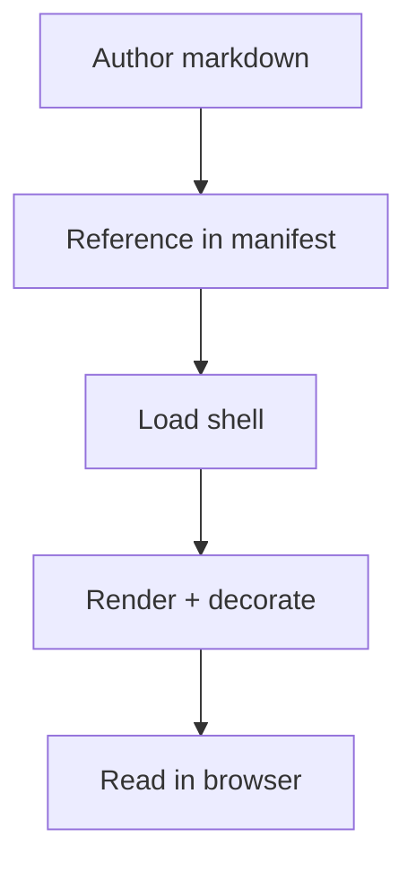

# About My Project

Welcome. This is a minimal source document rendered by the shell to prove the pattern works end to end. Replace it with your actual content.

## What you're looking at

The single-page HTML wrapper (`index.html`) has fetched `manifest.json`, resolved the active area + doc from the URL (defaults to `docs` + `about`), fetched `about.md` (this file), stripped its frontmatter and nav-strip markers, rendered the result through [marked](https://github.com/markedjs/marked), added a sidebar table of contents, and wired up alert-blockquote styling, syntax highlighting, and Mermaid diagram rendering. **No build step ran.** The shell is a viewer, not a generator.

## Extend the shell

Three levels of extension:

1. **Add more sources to this doc.** Append another `.md` path to `docs[0].sources` in `manifest.json`. The shell fetches them in order and concatenates with a blank line between.
2. **Add another doc to the area.** Append a new object to the area's `docs[]` array. Each entry becomes a button on line 2 of the topnav when its area is active.
3. **Add another area.** Append a new object to the top-level `areas[]` array. Each entry becomes a button on line 1 of the topnav. Its own `docs[]` populates line 2 when the area is active.

Either way: reload the browser. No build, no restart.

## Features you can layer in immediately

- **Alert blockquotes** — GitHub-flavored callouts (`> [!NOTE]`, `> [!TIP]`, `> [!WARNING]`, `> [!IMPORTANT]`, `> [!CAUTION]`) get styled automatically. Examples in the [Alert callout gallery](#alert-callout-gallery) below.
- **Mermaid diagrams** — fenced blocks tagged `mermaid` render inline (see the working example below).
- **Syntax-highlighted code** — any language recognized by `highlight.js`:

  ```javascript
  const shell = { markdown: "authoritative", html: "viewer" };
  ```

- **Per-doc emoji icon** — add `"icon": "🏠"` (single emoji character) to a doc entry in the manifest. Rendered at 22px in the sticky page-title header. Empty or absent collapses cleanly.
- **Big Idea in the hero** — `hero.subtitle` is the doc's one-sentence thesis. Authored per the [big-idea skill](https://github.com/fabioc-aloha/Alex_ACT_Steward/blob/main/.github/skills/big-idea/SKILL.md). The optional `hero.description` is metadata preserved in the manifest but not rendered by default.
- **QuickJumps** — add entries to `areas[N].quickJumps[]` to surface shortcuts in the topnav-right. Two shapes:

  ```json
  { "label": "Ten tenets", "doc": "act", "match": "Ten Tenets" }
  ```

  In-shell heading jump. `doc` is the `id` of an entry in the same area's `docs[]`; `match` is a case-insensitive `startsWith` prefix against any H1/H2/H3 in that doc.

  ```json
  { "label": "Sibling shell →", "external": "../sibling/index.html" }
  ```

  Cross-shell link. `external` is a path relative to this shell's `index.html`. External URLs (`http://…`) also work. Convention: `→` on outbound siblings, `←` on back-to-root. See the exemplar entries in `manifest.json` and edit or delete once you know your own nav.

- **Theme** — edit `manifest.theme.light` and `manifest.theme.dark` to re-theme without touching the HTML. The value guard accepts only `--`-prefixed keys with hex / rgb / hsl / named-color values.
- **Brand icon** — uncomment the `` line in `index.html` and drop your own SVG at `assets/<name>.svg`.
- **Nav-strips** — add `<!-- nav-strip --> ... <!-- /nav-strip -->` markers around per-file navigation lines so they show on GitHub but strip cleanly in shell view.
- **HTML-source docs** — when a doc's `sources[]` are all `.html` files, the shell links the topnav button directly at the file instead of injecting into the shell wrapper. Useful for Flint chart reports, exported dashboards, or any pre-built HTML that owns its own cover / hero / styling. See the [Example report](?area=docs&doc=report) doc that ships with this starter; open it via the topnav on line 2.

## Alert callout gallery

<!-- markdownlint-disable MD028 -->
<!-- MD028: adjacent GitHub alert callouts require blank-line separators to render as distinct alerts; suppressing "blank line inside blockquote" for this gallery block only. -->

> [!NOTE]
> Useful information a reader should notice even when skimming.

> [!TIP]
> Optional insight to make things easier or better.

> [!IMPORTANT]
> Key information a reader needs to know before proceeding.

> [!WARNING]
> Urgent information a reader needs to know to avoid problems.

> [!CAUTION]
> Negative potential consequences of an action.

<!-- markdownlint-enable MD028 -->

## Mermaid diagram



## Next steps

Full field-by-field reference for the manifest schema, theme system, path rewriting, optional features, and troubleshooting lives at the [docs-shell reference](https://github.com/fabioc-aloha/Alex_ACT_Illustrator_Plugin/blob/main/docs/shell/README.md).
