# Mermaid Diagram Type Quick Reference

Per-type syntax reference for all 23 Mermaid diagram types. Complements the main SKILL.md's ATACCU workflow and quality gates.

> **Source**: mermaid-js/mermaid v11.x documentation. Recheck: <https://mermaid.js.org/syntax/>

---

## Type Selection Guide

| Category | Types | Best For |
| -------- | ----- | -------- |
| **Flow & Process** | flowchart, sequence, state, journey, gantt, kanban, timeline | Workflows, APIs, lifecycles |
| **Software & Architecture** | class, ER, C4, architecture-beta, block, packet, gitGraph | System design, schemas |
| **Data & Analysis** | pie, xychart, sankey, quadrant, radar-beta, treemap-beta | Metrics, proportions |
| **Conceptual** | mindmap, requirements, zenuml | Brainstorming, tracing |

---

## 1. Flowchart

```mermaid
flowchart LR     %% LR, TD/TB, BT, RL
    A[Rectangle] --> B(Rounded) --> C{Decision}
    C -->|Yes| D[(Database)]
    C -->|No| E((Circle))
```

**Arrows**: `-->` solid, `-.->` dotted, `==>` thick, `~~~` invisible, `<-->` bidirectional, `--o` circle end, `--x` cross end

**Shapes**: `[rect]` `(rounded)` `([stadium])` `[[subroutine]]` `[(cylinder)]` `((circle))` `{rhombus}` `{{hexagon}}` `[/parallelogram/]`

**Gotcha**: Word "end" in lowercase at line start breaks diagrams — use `"end"` or `End`

---

## 2. Sequence Diagram

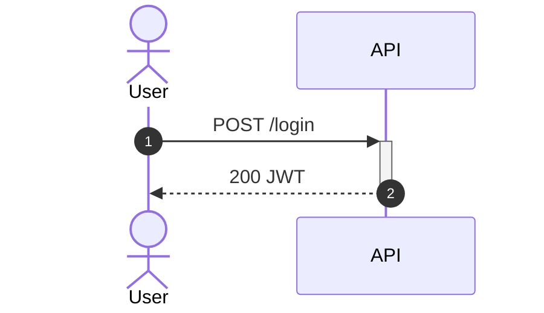

**Messages**: `->>` sync, `-->>` async/return, `-)` fire-and-forget, `-x` error

**Blocks**: `loop`, `alt/else`, `opt`, `par/else`, `critical`, `break`

**Notes**: `Note over A,B: text` or `Note right of A: text`

---

## 3. Class Diagram

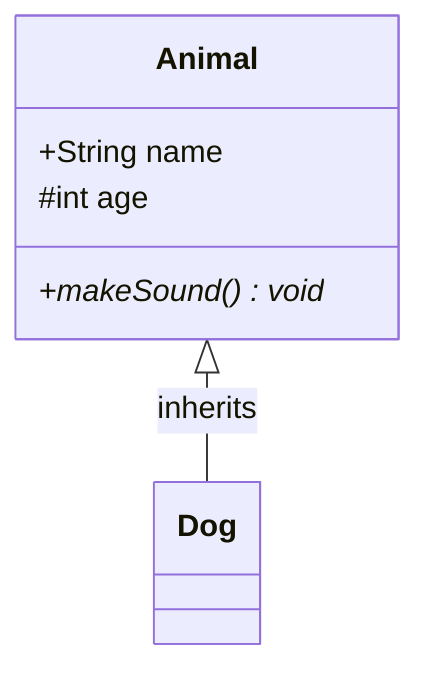

**Visibility**: `+` public, `-` private, `#` protected, `~` package

**Relations**: `<|--` inheritance, `*--` composition, `o--` aggregation, `-->` association, `..|>` realization

**Generics**: `class List~T~`

---

## 4. State Diagram

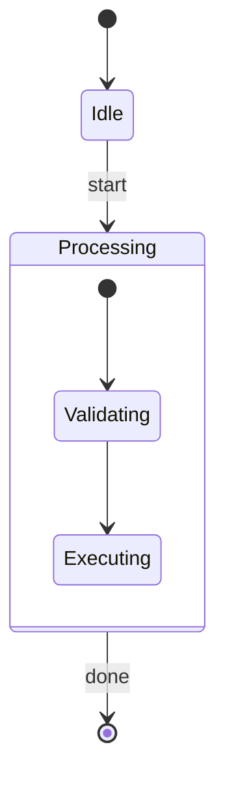

**Special**: `<<choice>>` for conditionals, `<<fork>>`/`<<join>>` for concurrency, `--` separator for parallel states

---

## 5. ER Diagram

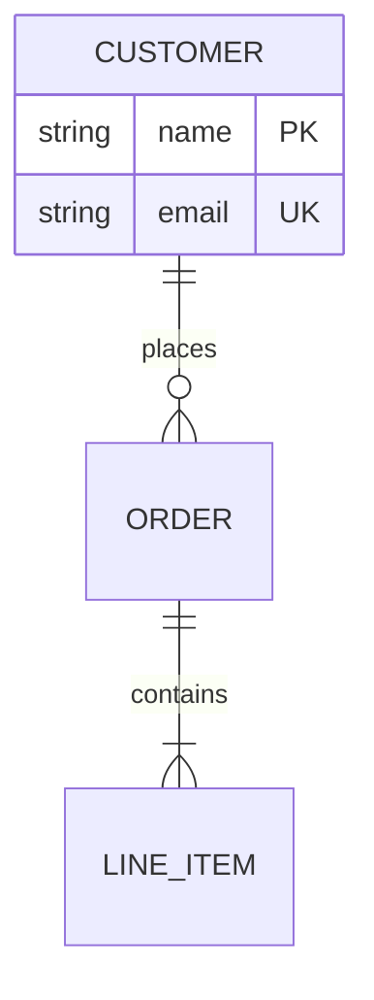

**Cardinality**: `||` exactly one, `|o` zero or one, `}|` one or more, `}o` zero or more

**Line**: `--` identifying (solid), `..` non-identifying (dashed)

---

## 6. User Journey

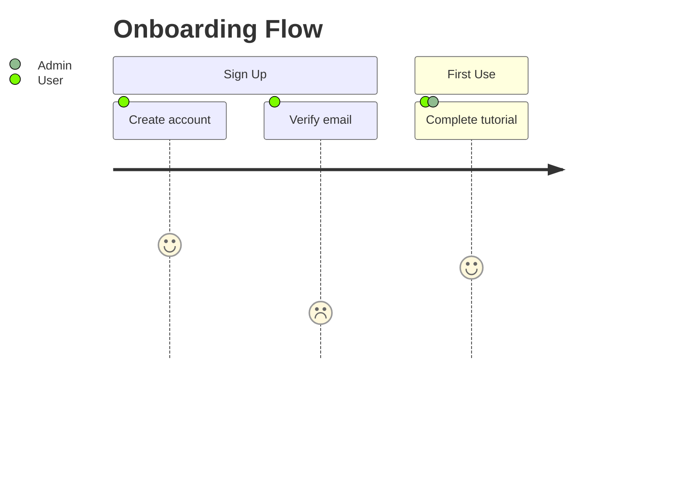

**Scores**: 1-5 (higher = better experience)

---

## 7. Gantt Chart

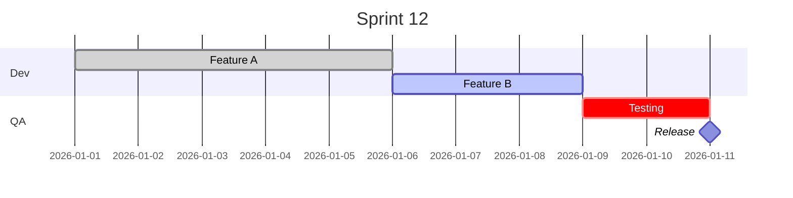

**Tags**: `done`, `active`, `crit`, `milestone`

---

## 8. Pie Chart

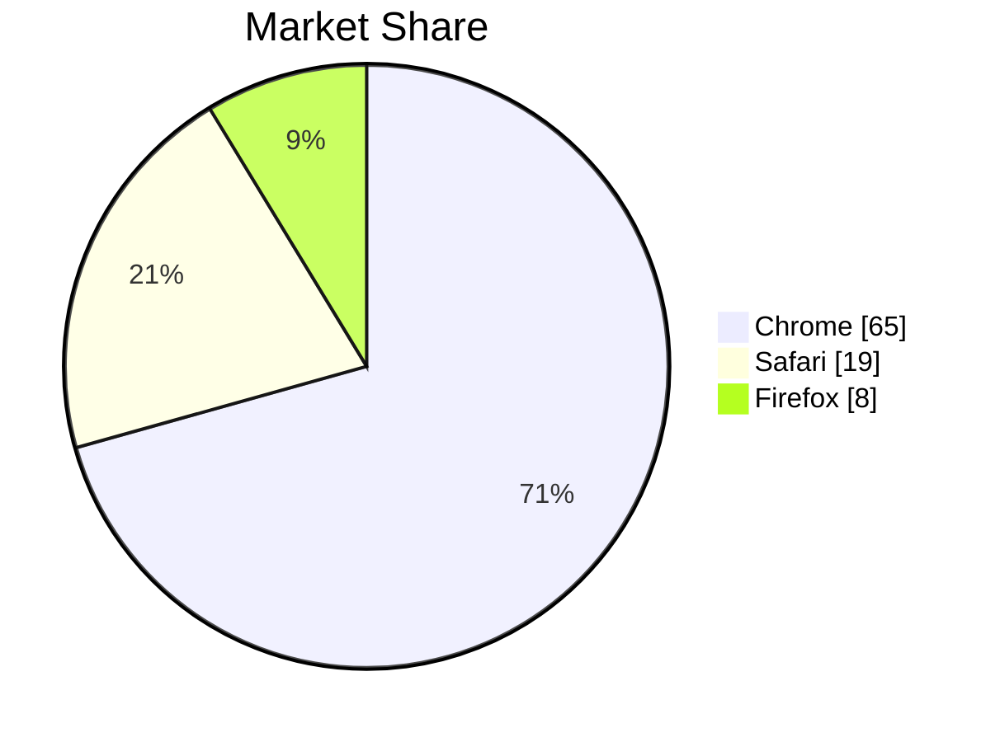

---

## 9. Git Graph

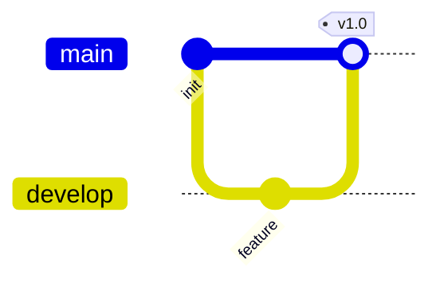

**Orientation**: `LR` (default), `TB`, `BT`

**Commit types**: `NORMAL`, `HIGHLIGHT`, `REVERSE`

---

## 10. C4 Diagram

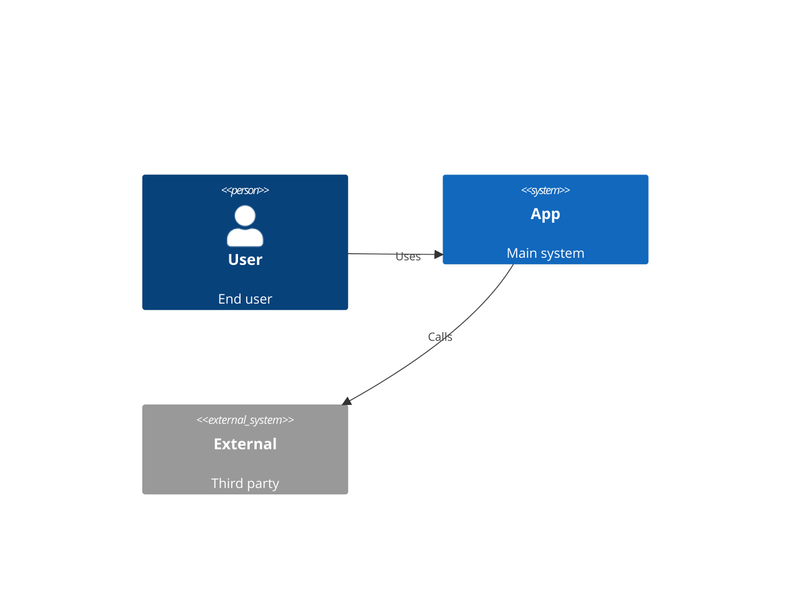

**Levels**: `C4Context`, `C4Container`, `C4Component`, `C4Dynamic`, `C4Deployment`

**Boundaries**: `Enterprise_Boundary`, `System_Boundary`, `Boundary`

---

## 11. Mindmap

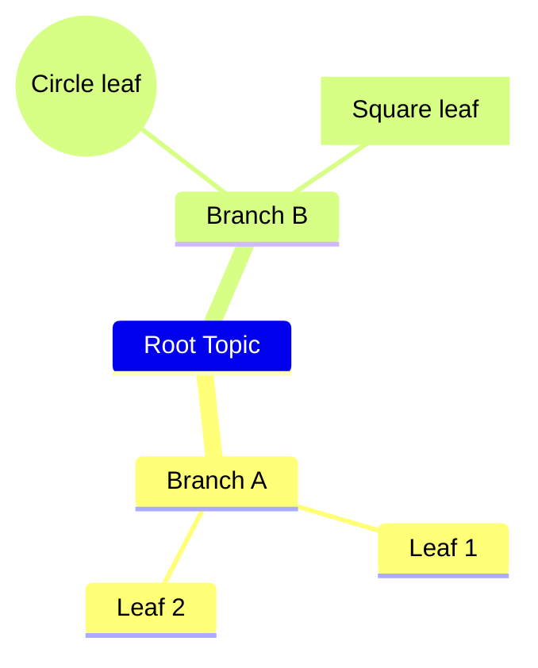

**Shapes**: plain (default), `[square]`, `(rounded)`, `((circle))`, `))bang((`, `)cloud(`, `{{hexagon}}`

**Important**: Hierarchy is via indentation (like Python)

---

## 12. Timeline

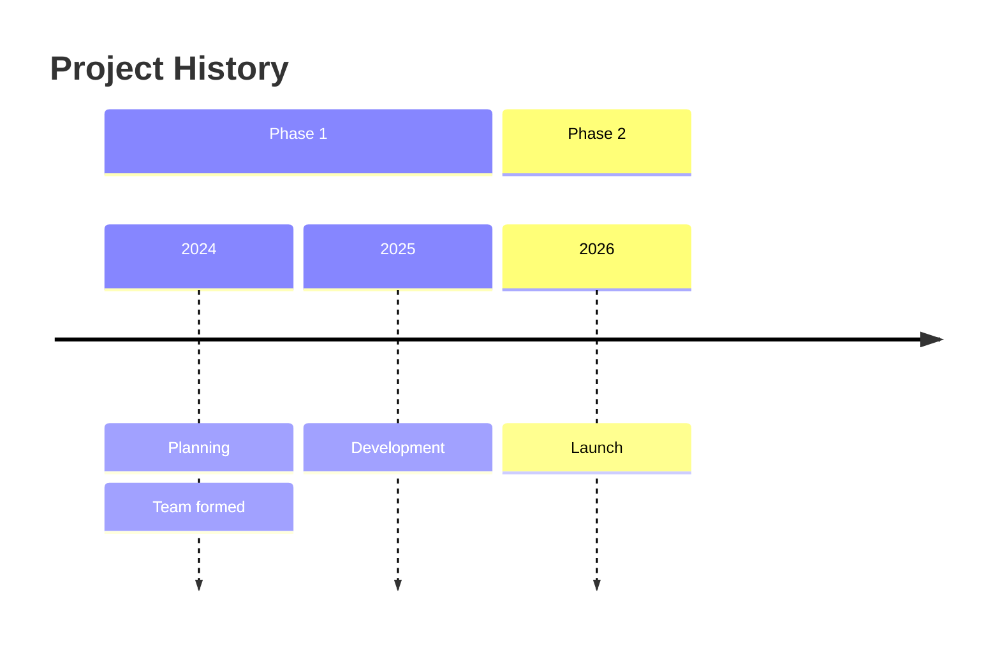

---

## 13. Sankey

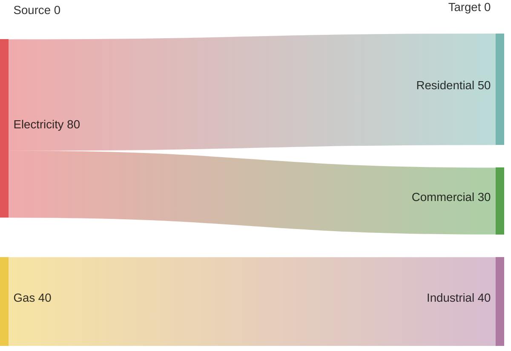

**Config**: `linkColor`: `source`, `target`, `gradient`, or hex color

---

## 14. XY Chart

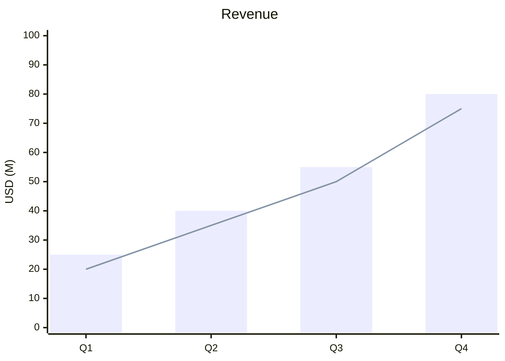

---

## 15. Block Diagram

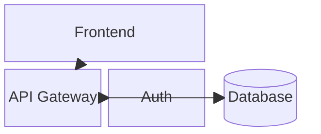

**Width**: `name:2` spans 2 columns. `space` = empty cell.

---

## 16. Packet Diagram

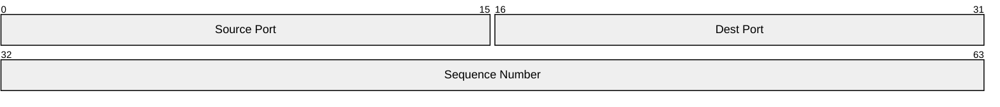

---

## 17. Quadrant Chart

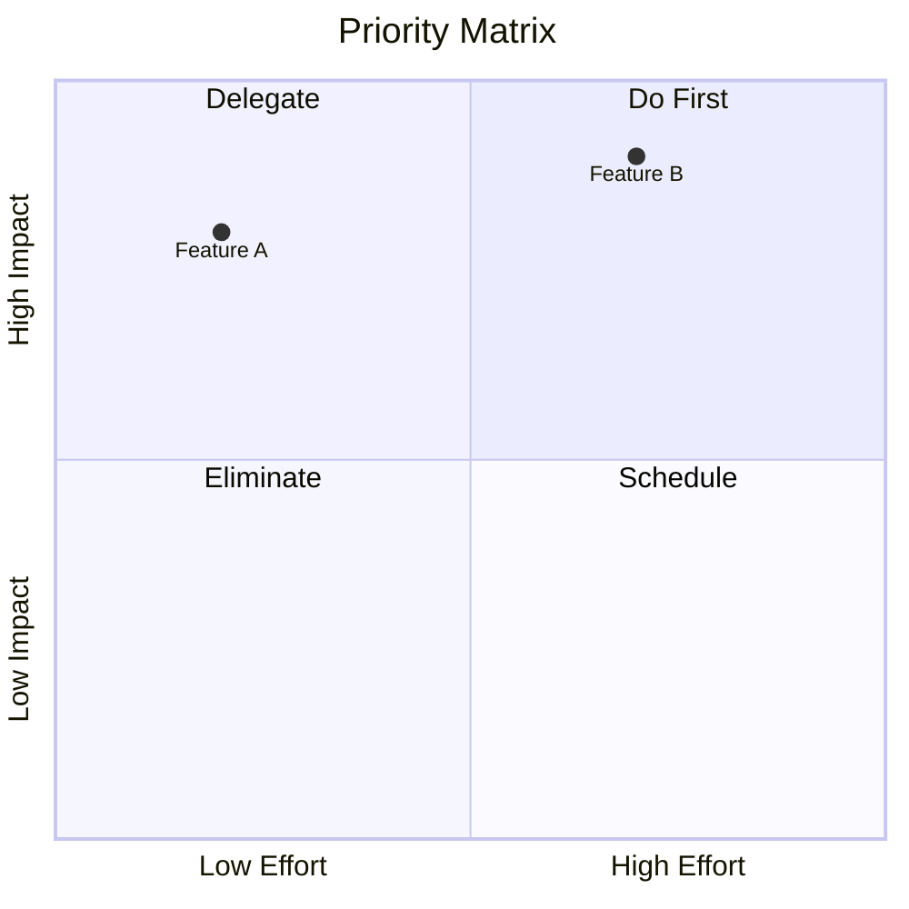

---

## 18. Kanban

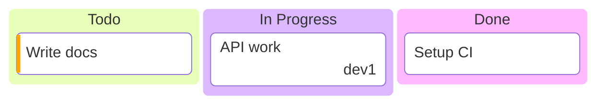

---

## 19. Architecture (Beta)


**Icons**: `cloud`, `database`, `disk`, `internet`, `server` (or iconify)

**Sides**: `T`, `B`, `L`, `R`

---

## 20. ZenUML

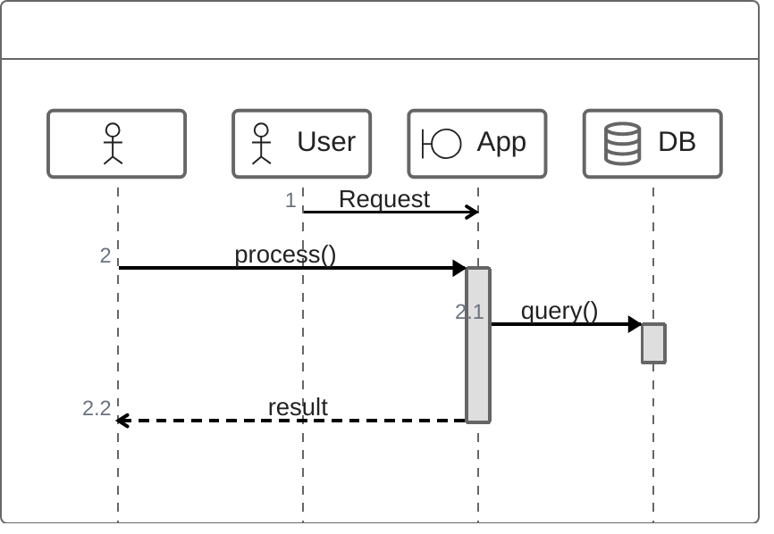

---

## 21. Requirement Diagram

```mermaid
requirementDiagram
    requirement auth {
        id: 1
        text: System shall authenticate users
        risk: High
        verifymethod: Test
    }
    element login_page { type: interface }
    login_page - satisfies -> auth
```

---

## 22. Radar Chart (Beta)

```mermaid
radar-beta
    axis "Speed", "Cost", "Quality", "UX"
    curve "Option A"{8, 5, 7, 9}
    curve "Option B"{6, 9, 8, 7}
```

---

## 23. Treemap (Beta)

```mermaid
treemap-beta
    title Budget
    "Engineering"
        "Backend": 300
        "Frontend": 200
    "Marketing": 150
```

---

## Common Pitfalls by Type

| Type | Pitfall | Fix |
| ---- | ------- | --- |
| flowchart | `end` keyword breaks parser | Quote it: `"end"` |
| sequence | Missing `autonumber` | Always add for readability |
| gantt | Wrong `dateFormat` | Match your date strings exactly |
| mindmap | Wrong indentation | Use consistent spaces (hierarchy = indent) |
| timeline | Colons in text | Wrap in quotes or rephrase |
| C4 | Wrong boundary nesting | Context → Container → Component (never skip) |
| gitGraph | `main` not named | Add `%%{init: {'gitGraph': {'mainBranchName': 'main'}}}%%` |
| sankey | Commas in labels | Wrap in double quotes |
| architecture | Missing side annotations | Always specify `:R`, `:L`, `:T`, `:B` on edges |
