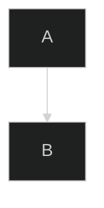

# Mermaid Best Practices and Recommendations

Comprehensive guide to creating effective, accessible, and performant Mermaid diagrams.

**Source**: mermaid-js/mermaid repository documentation and community best practices

---

## Table of Contents

1. [Accessibility Best Practices](#accessibility-best-practices)
2. [Syntax and Structure](#syntax-and-structure)
3. [Performance and Loading](#performance-and-loading)
4. [Security Best Practices](#security-best-practices)
5. [Theming and Styling](#theming-and-styling)
6. [Layout and Organization](#layout-and-organization)
7. [Diagram-Specific Practices](#diagram-specific-practices)
8. [Common Pitfalls](#common-pitfalls)
9. [Testing and Validation](#testing-and-validation)
10. [Integration Patterns](#integration-patterns)

---

## Accessibility Best Practices

### Always Add Accessible Metadata

**Required for all diagrams**:

```markdown
---
title: Diagram Title
---
flowchart TD
    accTitle: User Authentication Flow
    accDescr: Diagram showing complete user login process with error handling

    A --> B
```

**Multi-line descriptions**:
```
accDescr {
    Comprehensive diagram illustrating the authentication workflow
    including credential validation, session management, and error handling
    Updated: 2024-01-15
}
```

### Benefits

- Screen reader compatibility
- SEO improvements
- Documentation searchability
- Team understanding
- Compliance requirements

### Automatic ARIA Attributes

Mermaid automatically generates:
- `aria-roledescription` based on diagram type
- `aria-labelledby` linking to title
- `aria-describedby` linking to description
- `<title>` and `<desc>` SVG elements

### Color Accessibility

**Use color-blind friendly palettes**:
```yaml
config:
  theme: base
  themeVariables:
    primaryColor: '#0066cc'    # Blue
    secondaryColor: '#ff9900'  # Orange
    tertiaryColor: '#00aa00'   # Green
```

**Avoid problematic combinations**:
- Red/Green only differentiation
- Low contrast text
- Color as only indicator

**Test with tools**:
- Chrome DevTools color contrast analyzer
- Color blindness simulators
- WCAG contrast checkers

---

## Syntax and Structure

### Configuration Best Practices

**Use modern frontmatter** (v10.5.0+):
```yaml
---
config:
  theme: forest
  flowchart:
    curve: basis
---
```

**Avoid deprecated directives**:
```
%%{init: {'theme':'forest'}}%%  ❌ Deprecated
```

### Avoid Common Pitfalls

**Quote reserved words**:
```
%% WRONG
flowchart TD
    start --> end

%% RIGHT
flowchart TD
    start --> "end"
```

**Avoid curly braces in comments**:
```
%% WRONG: {this breaks} the parser
%% RIGHT: this works fine
```

**Use proper escaping**:
```
flowchart TD
    A["Text with \"quotes\" inside"]
    B["Text with special: chars"]
```

### Consolidate Configuration

**Good - Single config block**:
```yaml
---
config:
  theme: base
  themeVariables:
    primaryColor: '#0066cc'
  flowchart:
    curve: basis
    useMaxWidth: true
---
```

**Bad - Split configuration**:
```
%%{init: {'theme':'base'}}%%
%%{init: {'flowchart': {'curve':'basis'}}}%%
```

### Structure Large Diagrams

**Use subgraphs for organization**:
```
flowchart TB
    subgraph frontend [Frontend Layer]
        UI --> Controller
    end

    subgraph backend [Backend Layer]
        API --> Service
    end

    frontend --> backend
```

**Break into multiple diagrams**:
- One diagram per logical flow
- 10-15 nodes maximum per diagram
- Link diagrams with references

---

## Performance and Loading

### Font Loading

**Initialize after page load** with custom fonts:

```javascript
$(document).ready(function () {
    mermaid.initialize({ startOnLoad: true });
});
```

Or:

```javascript
window.addEventListener('load', function() {
    mermaid.initialize({ startOnLoad: true });
});
```

### Rendering Methods

**Prefer `mermaid.run()`** (v10+):
```javascript
// Modern
await mermaid.run({ querySelector: '.mermaid' });

// Deprecated
mermaid.init(undefined, '.mermaid');  ❌
```

**Manual rendering control**:
```javascript
mermaid.initialize({ startOnLoad: false });

// Render specific diagrams
await mermaid.run({ querySelector: '.custom-mermaid' });
```

### Optimize for Size

**Use Mermaid Tiny** (~50% size reduction):
```javascript
import mermaid from 'mermaid/dist/mermaid.esm.mjs';  // Full
import mermaid from 'mermaid/dist/mermaid-tiny.esm.mjs';  // Tiny
```

**Tiny omits**:
- Mindmap
- Architecture (beta)
- KaTeX support

**Lazy load icon packs**:
```javascript
// Load icons only when needed
import { registerIconPacks } from '@iconify/utils';

// In bundler config
optimization: {
    splitChunks: {
        cacheGroups: {
            icons: {
                test: /[\\/]iconify/,
                name: 'icons',
                chunks: 'async'
            }
        }
    }
}
```

### Bind Functions After Insertion

**For click events**:
```javascript
// Generate diagram first
const { svg } = await mermaid.render('diagram-id', diagramDef);
document.getElementById('container').innerHTML = svg;

// Then bind events
document.getElementById('nodeId').onclick = function() {
    // Handle click
};
```

---

## Security Best Practices

### securityLevel Configuration

**For user-provided content**:
```javascript
mermaid.initialize({
    securityLevel: 'strict'  // Disables clicks, scripts
});
```

**For trusted content**:
```javascript
mermaid.initialize({
    securityLevel: 'loose'  // Enables interactivity
});
```

**For public-facing applications**:
```javascript
mermaid.initialize({
    securityLevel: 'sandbox'  // Renders in iframe
});
```

### Keep Updated

**Regular updates**:
```bash
npm update mermaid
```

**Check security advisories**:
- GitHub Security Advisories
- npm audit
- Dependabot alerts

**Subscribe to notifications**:
- Watch mermaid-js/mermaid repository
- Enable security alerts
- Review changelogs

### DOMPurify

**Use default sanitization**:
```javascript
// Default - recommended
mermaid.initialize({});  // DOMPurify enabled
```

**Custom sanitization** (use with caution):
```javascript
mermaid.initialize({
    dompurifyConfig: {
        ALLOWED_TAGS: ['b', 'i', 'em', 'strong', 'br']
    }
});
```

### Report Vulnerabilities

**Contact**: security@mermaid.live

**Provide**:
- Vulnerability description
- Steps to reproduce
- Affected versions
- Potential mitigations

---

## Theming and Styling

### Theme Selection Strategy

**Match your use case**:
- `default` - General purpose, color
- `neutral` - Print, black and white
- `dark` - Dark mode interfaces
- `forest` - Nature-inspired, green
- `base` - Customization starting point

**Set site-wide**:
```javascript
mermaid.initialize({
    theme: 'dark'
});
```

**Override per-diagram**:
```yaml
---
config:
  theme: neutral
---
```

### Color Customization

**Use only hex colors**:
```yaml
themeVariables:
  primaryColor: '#0066cc'   ✓
  primaryColor: 'blue'      ✗ Not supported
```

**Start with primaryColor**:
```yaml
themeVariables:
  primaryColor: '#0066cc'
  # Other colors derived automatically
```

**Override specific colors**:
```yaml
themeVariables:
  primaryColor: '#0066cc'
  primaryTextColor: '#ffffff'  # Override derived color
  lineColor: '#0066cc'
```

**Dark mode**:
```yaml
themeVariables:
  darkMode: true
  primaryColor: '#4a9eff'
  background: '#1e1e1e'
```

### Consistent Styling

**Define reusable classes**:
```
classDef errorClass fill:#f99,stroke:#f00,stroke-width:2px
classDef successClass fill:#9f9,stroke:#0f0,stroke-width:2px

class ErrorNode errorClass
class SuccessNode successClass
```

**Use across diagrams**:
- Define classes in site-wide CSS
- Reference in multiple diagrams
- Maintain visual consistency

---

## Layout and Organization

### Choose Appropriate Direction

**Match natural flow**:
- **LR**: Processes, timelines (left to right reading)
- **TB**: Hierarchies, org charts (top-down authority)
- **RL**: Reverse processes (right to left languages)
- **BT**: Bottom-up flows (less common)

```
flowchart LR   %% Process flow
    Start --> Process --> End

flowchart TB   %% Organizational hierarchy
    CEO --> VP1
    CEO --> VP2
```

### Layout Algorithms

**dagre (default)** - Good for most cases:
```yaml
config:
  layout: dagre
```

**elk** - Better for complex diagrams:
```yaml
config:
  layout: elk
  elk:
    nodePlacementStrategy: BRANDES_KOEPF  # Minimize crossings
```

**Strategy options**:
- `SIMPLE` - Fast, basic
- `LINEAR_SEGMENTS` - Balanced
- `BRANDES_KOEPF` - Minimize edge crossings (recommended)
- `NETWORK_SIMPLEX` - Optimize edge lengths

### Subgraph Organization

**Group related nodes**:
```
flowchart TB
    subgraph auth [Authentication]
        Login --> Verify
    end

    subgraph data [Data Layer]
        DB --> Cache
    end
```

**Control subgraph direction**:
```
flowchart TB
    subgraph horizontal
        direction LR
        A --> B
    end
```

---

## Diagram-Specific Practices

### Flowcharts

**Choose appropriate shapes**:
- **Rectangles**: Standard processes
- **Diamonds**: Decisions (always 2+ outputs)
- **Circles/Stadiums**: Start/end points
- **Cylinders**: Databases
- **Rounded rectangles**: Events

**Arrow types**:
- **Solid**: Primary flow
- **Dotted**: Alternative/conditional
- **Thick**: Critical paths

**Example**:
```
flowchart TB
    Start([Start])
    Process[Process Data]
    Decision{Valid?}
    Error[Show Error]
    Success([Complete])

    Start --> Process
    Process --> Decision
    Decision -->|No| Error
    Decision -->|Yes| Success
    Error --> Process
```

### Sequence Diagrams

**Participant organization**:
```
sequenceDiagram
    %% Define order explicitly
    actor User
    participant Frontend
    participant Backend
    participant Database
```

**Use appropriate arrows**:
- `A->>B` - Synchronous call (solid)
- `A-->>B` - Asynchronous response (dashed)
- `A-)B` - Fire and forget (no arrow)

**Enable autonumbering** for complex diagrams:
```
sequenceDiagram
    autonumber

    User->>API: Request
    API->>DB: Query
    DB-->>API: Result
    API-->>User: Response
```

**Use activation boxes**:
```
sequenceDiagram
    User->>+API: Request
    API->>+DB: Query
    DB-->>-API: Result
    API-->>-User: Response
```

### Class Diagrams

**Naming conventions**:
- **Classes**: PascalCase (UserAccount)
- **Attributes**: camelCase (userName)
- **Methods**: camelCase with parentheses (getName())

**Show visibility**:
```
class User {
    +String username    # Public
    -String password    # Private
    #int userId         # Protected
    ~String session     # Package
    +login()
    -validatePassword()
}
```

**Use cardinality**:
```
User "1" --> "*" Order : places
Order "1" --> "1..*" LineItem : contains
```

### Gantt Charts

**Define sections**:
```
gantt
    title Project Timeline
    dateFormat YYYY-MM-DD

    section Planning
        Requirements :done, 2024-01-01, 5d
        Design :done, 2024-01-06, 5d

    section Development
        Backend :active, 2024-01-11, 10d
        Frontend :2024-01-16, 8d
```

**Show dependencies**:
```
gantt
    Task A :done, t1, 2024-01-01, 3d
    Task B :active, t2, after t1, 5d
    Task C :crit, t3, after t2, 2d
```

**Mark critical path**:
```
Task :crit, t1, 2024-01-01, 5d
```

---

## Common Pitfalls

### Avoid These Mistakes

**1. Overcomplicating diagrams**:
```
%% BAD - too complex
flowchart TD
    A --> B --> C --> D --> E --> F --> G --> H --> I --> J

%% GOOD - break into logical groups
flowchart TD
    subgraph input [Input Processing]
        A --> B --> C
    end
    subgraph processing [Core Processing]
        D --> E --> F
    end
    subgraph output [Output Generation]
        G --> H --> I
    end
    input --> processing --> output
```

**2. Missing accessibility metadata**:
```
%% BAD - no metadata
flowchart TD
    A --> B

%% GOOD - includes accessibility
flowchart TD
    accTitle: Process Flow
    accDescr: Simple two-step process
    A --> B
```

**3. Using deprecated syntax**:
```
%% BAD - deprecated directive
%%{init: {'theme':'forest'}}%%

%% GOOD - frontmatter
---
config:
  theme: forest
---
```

**4. Inconsistent naming**:
```
%% BAD - mixed conventions
flowchart TD
    UserLogin --> check_password --> SendEmail

%% GOOD - consistent camelCase
flowchart TD
    userLogin --> checkPassword --> sendEmail
```

**5. Hardcoding colors without theme**:
```
%% BAD - direct color, bypasses theme
style A fill:#ff0000

%% GOOD - use theme variables
---
config:
  theme: base
  themeVariables:
    primaryColor: '#ff0000'
---
```

---

## Testing and Validation

### Use Mermaid Live Editor

**For every diagram**:
1. Paste syntax into https://mermaid.live
2. Verify rendering
3. Test theme variations
4. Export if needed
5. Copy final syntax

### Test in Target Environment

**GitHub/GitLab**:
- Preview before committing
- Test in README.md
- Verify on mobile

**Documentation systems**:
- Test in Confluence/Notion
- Check rendering behavior
- Validate link handling

### Validate Syntax

**Common checks**:
- [ ] Diagram type declared correctly
- [ ] All nodes have unique IDs
- [ ] Arrows point to existing nodes
- [ ] Reserved words quoted
- [ ] Special characters escaped
- [ ] Accessibility metadata added
- [ ] Configuration valid YAML

### Cross-Browser Testing

Test diagrams in:
- Chrome/Edge (Chromium)
- Firefox
- Safari
- Mobile browsers

**Note**: IE not supported

---

## Integration Patterns

### GitHub/GitLab

**In markdown files**:
````markdown

````

**With frontmatter**:
````markdown

````

### HTML Integration

**Basic setup**:
```html
<script type="module">
  import mermaid from 'https://cdn.jsdelivr.net/npm/mermaid@10/dist/mermaid.esm.min.mjs';
  mermaid.initialize({ startOnLoad: true });
</script>

<pre class="mermaid">
flowchart TD
    A --> B
</pre>
```

**Multiple diagrams**:
```html
<pre class="mermaid">
flowchart TD
    A --> B
</pre>

<pre class="mermaid">
sequenceDiagram
    A->>B: Message
</pre>
```

### React Integration

```javascript
import mermaid from 'mermaid';
import { useEffect, useRef } from 'react';

function MermaidDiagram({ chart }) {
  const ref = useRef(null);

  useEffect(() => {
    if (ref.current) {
      mermaid.initialize({ startOnLoad: false });
      mermaid.contentLoaded();
    }
  }, [chart]);

  return <div ref={ref} className="mermaid">{chart}</div>;
}
```

### Documentation Systems

**Docusaurus**:
```markdown
# Page Title


```

**GitBook**:
- Install mermaid plugin
- Use standard markdown syntax

**Confluence**:
- Use "Mermaid Diagrams" macro
- Paste diagram syntax

---

## General Best Practices Summary

### Always Do

✓ Add `accTitle` and `accDescr` to all diagrams
✓ Use frontmatter for configuration
✓ Test at mermaid.live before finalizing
✓ Quote reserved words
✓ Use consistent naming conventions
✓ Break complex diagrams into smaller ones
✓ Add comments for complex logic
✓ Use themes for consistent styling
✓ Keep Mermaid updated
✓ Test in target rendering environment

### Never Do

✗ Skip accessibility metadata
✗ Use deprecated directive syntax
✗ Create diagrams with 20+ nodes
✗ Hardcode colors without theme
✗ Use mixed naming conventions
✗ Leave syntax errors unvalidated
✗ Forget to test on mobile
✗ Use untested special characters
✗ Omit comments in complex diagrams
✗ Ignore security best practices

---

## Quick Reference Checklist

Before finalizing a diagram:

- [ ] Accessibility: Added `accTitle` and `accDescr`
- [ ] Configuration: Using frontmatter (not directives)
- [ ] Syntax: Tested at mermaid.live
- [ ] Structure: Diagram has < 15 nodes or uses subgraphs
- [ ] Styling: Using theme variables, not hardcoded colors
- [ ] Comments: Complex logic documented with `%%`
- [ ] Naming: Consistent convention throughout
- [ ] Testing: Validated in target environment
- [ ] Security: Appropriate `securityLevel` if interactive
- [ ] Performance: Optimized for loading if needed

---

## Additional Resources

**Official Documentation**:
- Main docs: https://mermaid.js.org
- Config reference: https://mermaid.js.org/config/configuration.html
- Theming: https://mermaid.js.org/config/theming.html

**Tools**:
- Live Editor: https://mermaid.live
- CLI: https://github.com/mermaid-js/mermaid-cli
- VS Code Extension: Mermaid Preview

**Community**:
- GitHub Discussions: https://github.com/mermaid-js/mermaid/discussions
- Discord: https://discord.gg/sKeNQX4Wtj

---

## Summary

**Core Principles**:
1. **Accessibility First**: Always add metadata
2. **Simplicity**: Break complex diagrams down
3. **Consistency**: Use themes and conventions
4. **Validation**: Test before deployment
5. **Security**: Use appropriate settings
6. **Performance**: Optimize loading
7. **Documentation**: Comment complex logic

For syntax details, see **syntax.md**.
For configuration options, see **configuration.md**.
For diagram types, see **diagram-types.md**.
