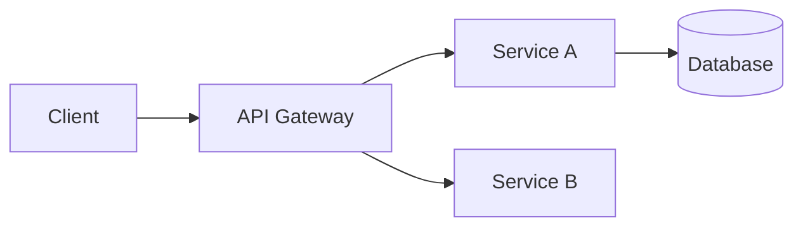

# Marp Presentation Workflow

Complete workflow for creating, building, reviewing, and theming Marp Markdown presentations.

## When to Use

- "Create a presentation about X"
- "Make slides from this codebase"
- "Export my deck to PDF/PPTX"
- "Review my slides"
- "Theme my presentation" / "Custom colors for my deck"
- "Marp deck from repo"

---

## Capability 1: Create Deck

Generate a complete Marp Markdown presentation from a topic, outline, or codebase analysis.

### Modes

#### Codebase-Driven Mode

When the user wants slides about their project:

1. **Analyze the repository** — read README, config files, identify tech stack and architecture
2. **Propose angles** — suggest 2–3 presentation framings:
   - Architecture overview (components, data flow)
   - Onboarding guide (setup, structure, workflow)
   - Technical deep dive (specific module or algorithm)
   - Demo walkthrough (features, user journey)
   - Decision review (trade-offs, alternatives considered)
3. **Generate the deck** per the rules below

#### Topic/Outline Mode

When the user provides a topic or bullet points:

1. **Clarify scope** — if broad, ask about audience and depth
2. **Structure narrative** — opening hook → core (3–5 sections) → summary/CTA
3. **Generate the deck**

### Frontmatter Template

```yaml
---
marp: true
theme: default
paginate: true
header: ""
footer: ""
---
```

Theme options: `default` (general), `gaia` (bold keynote), `uncover` (minimal).

### Slide Structure Rules

| Slide Type | Usage |
| ---------- | ----- |
| Title | `<!-- _class: lead -->` — title, subtitle, author, date |
| Agenda | 3–5 bullet overview of what's covered |
| Content | One idea per slide, 3–6 bullets max |
| Code | Fenced blocks with language specifier, 10–20 lines max |
| Diagram | Mermaid code blocks or image placeholders |
| Image | `` for split layouts |
| Summary | Key takeaways |
| Closing | Q&A / contact |

### Content Quality Rules

- **One idea per slide** — two topics = two slides
- **6×6 guideline** — max 6 bullets, max 6 words per bullet
- **Progressive disclosure** — build complexity gradually
- **Mix layouts** — alternate text, code, images, split slides
- **Speaker notes** — `<!-- Speaker note text -->` after content
- **Headings required** — every slide gets an h1 or h2

### Technical Deck Patterns

```markdown
<!-- _class: lead -->
# Architecture Overview
How the system fits together

---

## System Components



---

## Key Module: Auth

```typescript
// src/auth/middleware.ts — actual code from repo
export function authenticate(req, res, next) {
  const token = req.headers.authorization;
  // ...
}
```

<!-- Authentication middleware validates JWT tokens -->
```

### Output

Save to `presentation.md` (or user-specified path). Inform the user they can preview with `marp -s .` or the VS Code Marp extension.

---

## Capability 2: Build Deck

Convert a Marp Markdown file to HTML, PDF, PPTX, or image format.

### Output Formats

| Format | Flag | Best For |
| ------ | ---- | -------- |
| HTML | (default) | Web sharing, live presentations |
| PDF | `--pdf` | Printing, email attachments |
| PPTX | `--pptx` | Corporate sharing, editing in PowerPoint |
| PNG | `--images png` | Social media, thumbnails |

### Build Commands

```bash
# PDF (most universal)
marp slides.md -o slides.pdf --pdf-notes --pdf-outlines --allow-local-files

# PPTX
marp slides.md -o slides.pptx --allow-local-files

# HTML
marp slides.md -o slides.html --allow-local-files

# With custom theme
marp slides.md -o slides.pdf --theme ./custom-theme.css

# Watch mode (live preview)
marp -w slides.md

# Server mode (browser preview)
marp -s .

# Batch conversion
marp -I ./slides/ --pdf
```

### Important Flags

- `--allow-local-files` — required if deck references local images
- `--pdf-notes` — includes presenter notes in PDF
- `--pdf-outlines` — adds bookmarks to PDF

### CLI Availability Check

```bash
marp --version
# If not found: npx @marp-team/marp-cli@latest --version
```

### Common Errors

| Error | Cause | Fix |
| ----- | ----- | --- |
| `Browser not found` | PDF/PPTX needs Chrome/Edge | Install Chrome or set `CHROME_PATH` |
| `Theme not found` | Wrong theme path | Check `--theme` path or use `--theme-set` for directory |
| `Local file access blocked` | Image paths are local | Add `--allow-local-files` |
| `ENOENT` | Input file missing | Verify file path |

---

## Capability 3: Review Deck

Evaluate an existing Marp deck across 6 quality dimensions.

### Evaluation Dimensions

#### 1. Structure & Flow

- Clear narrative arc (intro → body → conclusion)?
- Title slide, agenda, and summary/closing present?
- Sections logically grouped?
- Appropriate slide count (1–2 min per slide)?

#### 2. Content Quality

- One main idea per slide?
- Bullets concise (no full sentences)?
- No walls of text (max 6–8 lines)?
- Consistent heading hierarchy?

#### 3. Marp Syntax

- `marp: true` in frontmatter?
- Valid YAML frontmatter?
- Slide separators (`---`) with blank lines above/below?
- Correct directive syntax (`<!-- _class: lead -->`)?
- Code blocks have language specifiers?

#### 4. Visual Variety

- Mix of slide types (text, code, image, split)?
- Not all bullet lists?
- Background images or split layouts used?
- Classes vary appearance (`lead`, `invert`)?

#### 5. Accessibility

- Sufficient text contrast?
- Alt text on images?
- Color not sole information carrier?
- Tables have headers?

#### 6. Speaker Notes

- Key slides have notes?
- Notes add talking points (not repeat slide content)?
- Pagination enabled?

### Review Output Format

```markdown
## Deck Review: <filename>

### Summary
<1–2 sentence assessment>

### Score: X/10

### ✅ Strengths
- <what works well>

### ⚠️ Issues Found
#### Structure & Flow
- **Slide N**: <issue and fix>

#### Content Quality
- **Slide N**: <issue and fix>

### 💡 Suggestions
1. <actionable improvement>
```

After review, offer to apply fixes automatically.

---

## Capability 4: Theme Customization

### Built-in Themes

| Theme | Style |
| ----- | ----- |
| `default` | Clean, minimal — general use |
| `gaia` | Bold, colorful — keynotes |
| `uncover` | Modern, content-focused |

Apply via frontmatter: `theme: gaia`

Useful classes: `<!-- _class: lead -->` (centered), `<!-- _class: invert -->` (dark mode)

### Quick Style Override (No Theme File)

```yaml
---
marp: true
theme: default
style: |
  section {
    background-color: #1a1a2e;
    color: #eaeaea;
    font-family: 'Segoe UI', sans-serif;
  }
  h1, h2 { color: #0078d4; }
  code { background: #2d2d2d; color: #d4d4d4; }
---
```

### Custom Theme File

For full control, create a CSS file (e.g., `theme-brand.css`):

```css
/* @theme brand-theme */
@import 'default';

:root {
  --primary: #0078d4;
  --bg: #ffffff;
  --fg: #333333;
}

section {
  background-color: var(--bg);
  color: var(--fg);
  font-family: 'Segoe UI', sans-serif;
  padding: 40px;
}

h1 { color: var(--primary); font-size: 2.2em; }
h2 { color: var(--primary); font-size: 1.6em; }

/* Lead slide — centered */
section.lead {
  display: flex;
  flex-direction: column;
  justify-content: center;
  text-align: center;
}

/* Invert class — dark background */
section.invert {
  background-color: #1a1a2e;
  color: #eaeaea;
}
```

Use with: `marp slides.md --theme ./theme-brand.css --pdf`

### Theme Design Process

1. **Gather requirements** — primary color, light/dark, font preference, special slide types
2. **Generate CSS** — base on `@import 'default'`, override custom properties
3. **Test** — build one slide with each class to verify rendering
4. **Document** — list available classes and their visual effect

---

## Workflow Integration

| User Request | Capability |
| ------------ | ---------- |
| "Create slides about X" | Create → Review → Build |
| "Export my deck" | Build |
| "Improve my presentation" | Review → apply fixes |
| "Make it look professional" | Theme → rebuild |
| "Full deck from scratch" | Create → Theme → Review → Build |

---

## Comparison with Other Presentation Skills

| Skill | Best For |
| ----- | -------- |
| **marp-presentation** (this) | Markdown-native slides, developer audiences, version-controlled decks |
| `gamma-presentation` | Visual-first, drag-and-drop import, non-technical audiences |
| `pptx-generation` | Programmatic PowerPoint via PptxGenJS, data-driven slides |
| `slide-design` | Visual design principles (applies to all tools) |
